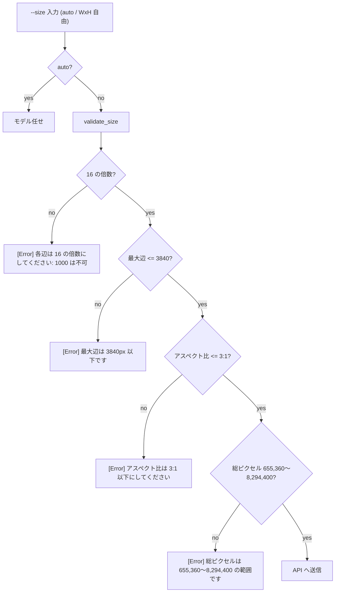

## 概要

現状の `--size` は `SIZE_CHOICES`(`auto` / `1024x1024` / `1024x1536` / `1536x1024`)の **4 値固定 enum** で、それ以外を argparse が弾く。これを **任意の `WxH` 入力を許す自由度ある設計** に作り替え、安全値の列挙ではなく **スクリプト側のバリデーション(制約違反を明示エラーで返す)** で守る方式へ刷新する。あわせて gpt-image-2 がモデルとして対応する **4K(最大辺 3840px)** をスキルからも出せるようにし、外部記事由来の制約値を **本プロジェクトで実証** する。

## 出典・背景調査(2026-06-08)

この issue は「4 パターン固定に実証的根拠があるか」の調査結果を受けて起票した。調査結論:

- **4 値固定は実証検証の結果ではない。** `SIZE_CHOICES` は initial commit `c502be6` に根拠の記載なく最初から 4 値で書かれていた(`git log -S "SIZE_CHOICES"` の変更コミットは initial の 1 件のみ)。
- **任意サイズ/4K の生成実績はゼロ。** `assets/` 配下 35 個のメタデータの `size` は `1024x1024`×15 / `1024x1536`×10 / `1536x1024`×10 の 3 値のみ。境界値検証なし。`docs/gallery` の Resolution×Quality Grid も既選定 3 サイズのコスト対品質比較で、サイズ境界探索ではない。
- **制約値の出所は外部記事。** 各辺 16 の倍数 / 最大辺 3840px / アスペクト比 3:1 以下 / 総ピクセル 655,360〜8,294,400 は issue `017.md:132-141` が「note.com/mauekusa 記事レビューで採用」と明記。`CLAUDE.md:67` も「出典: note.com/mauekusa 記事の**実証**」と自記しており、**実証主体は外部記事であって本プロジェクトではない**。コードの `choices` には未反映で文書記載のみ。
- **残課題として既出。** `017.md:173` に「size 厳密制御の改善余地あり」が未解決で残置。

→ 過去実証で 4 値に絞った経緯は存在しないため、自由入力 + バリデーション設計への作り替えを妨げる根拠はない。むしろ制約値は既に文書化済みで、そのままバリデーション仕様に転用できる。**ただし制約値自体は外部記事由来で本プロジェクト未検証** のため、本 issue の実証実験で確かめる。

## 方針

設計哲学: **enum で安易にパターンを絞って自由度を阻害しない。明確な制限があるなら自由度は残し、スクリプト側で制限チェックして明示エラーを出す。** これを基本実装とし、実証実験で「理想通りにはいかない」事象が判明してから個別に対処する(先回りで縛らない)。

backend 別の扱い:
- **api**: 制約を厳密に満たせば任意サイズが通る前提。バリデーション通過 → そのまま送信。
- **codex**: そもそもサイズが非決定的(`CLAUDE.md` の Codex 制約 4: 1024×1536 指定が 1254×1254 になった事例)。任意サイズを受けても保証できないため、**バリデーションは通すが「Codex ではサイズが保証されない」旨を警告**。厳密サイズが要るなら api を促す。

## 実装内容

1. **`SIZE_CHOICES` 撤廃 → 自由入力**: `--size` の `choices=` を外し、`auto` または `WxH`(正規表現 `^\d+x\d+$`)を受け付ける。デフォルトは現状維持(`1024x1024`)。既存 4 値はそのまま通る(後方互換)。
2. **`validate_size(size: str) -> tuple[int, int]` 追加**: 以下を順にチェックし、違反ごとに具体的な日本語エラー(どの値がどの制約に違反したか)を返す。
   - 各辺が 16 の倍数
   - 最大辺 ≤ 3840px
   - アスペクト比(長辺/短辺)≤ 3.0
   - 総ピクセル数 655,360 ≤ W×H ≤ 8,294,400
3. **TDD**: 上記境界値の単体テストを先に書く(各制約の合格/違反、ちょうど境界、後方互換の 4 値)。`tests/test_generate_image.py` に追加。
4. **SKILL.md / SKILL.ja.md にサイズ制約仕様を明記**: enum で隠さず、4 制約を表で開示する。「安全 4 値」は「よく使う例」として残し、自由指定の方法とコスト注意(4K は high で高コスト)を併記。
5. **README 仕様欄の追従更新**: 本 issue 完了後、現在の「CLI は最大 1536x1024」記述を「制約を満たせば 4K まで指定可」に更新(日英)。

## 実証実験(API 課金が発生 — 規模はユーザー確認の上で実施)

`--backend api` で境界値を実生成し、**外部記事の制約値が実際の API 挙動と一致するか** を記録する。

| 観点 | テスト値 | 期待 |
|---|---|---|
| 4K landscape | `3840x2160`(=8,294,400 上限ちょうど) | 成功 |
| 4K portrait | `2160x3840` | 成功 |
| 16 倍数違反 | `1000x1000` | バリデーションで弾く / API も 400 か確認 |
| 3:1 超過 | `3840x1024`(3.75:1) | 弾く |
| 総ピクセル下限割れ | `512x512`(=262,144) | 弾く |
| 下限ちょうど | `1024x640`(=655,360) | 成功 |

各ケースで「バリデーション結果」「API レスポンス(成功/400)」「実際に返った解像度」を記録し、`docs/` に検証ノートとして残す。実験コスト概算: high の 4K は 1 枚 ~$0.3 前後、10 枚規模で ~$2-4。Tier 1 は 5 IPM 制限に注意。

## スコープ外

- **Codex backend での厳密サイズ制御**: 非決定的なため本 issue では対応せず、警告に留める。
- **透過 PNG / gpt-image-1.5 廃止対応**: 別件(報告済み、別 issue 候補)。
- 公開(#004)・他フェーズとは独立しており、いつでも着手可能。

## 完了条件

- [ ] `validate_size()` 実装 + 境界値の単体テスト(TDD で先行)
- [ ] `--size` 自由入力化(`choices` 撤廃、後方互換維持)
- [ ] backend 別の扱い(api=厳密 / codex=警告)実装
- [ ] 実証実験で各制約の実 API 挙動を確認し `docs/` に記録
- [ ] 実験結果に基づき制約値を確定(外部記事値の妥当性を本プロジェクトで検証)
- [ ] SKILL.md / SKILL.ja.md にサイズ制約仕様を明記
- [ ] README 仕様欄(日英)を実態に更新

## 関連情報

- 派生元調査: 本日(2026-06-08)の README 仕様欄ファクトチェック(「最大解像度 2K」は誤り、モデルは 4K 可)。
- 制約値の出所: `017.md:132-141`、`CLAUDE.md:67`(外部記事 note.com/mauekusa)。
- 残課題の出所: `017.md:173`「size 厳密制御の改善余地あり」。
- 影響: SKILL.md 姉妹比較表「4K output → ccskill-nanobanana(gpt-image-2 caps at 2K)」も同根の誤りで、本 issue 完了時に併せて修正候補。

## 作業記録

- 2026-06-08: README ファクトチェック(サブエージェント 3 並列)で「最大解像度 2K」が誤りと判明。続けて「4 パターン固定の実証根拠」を調査し、実証記録なし(外部記事由来の安全寄せ)と断定。本 issue を起票。
