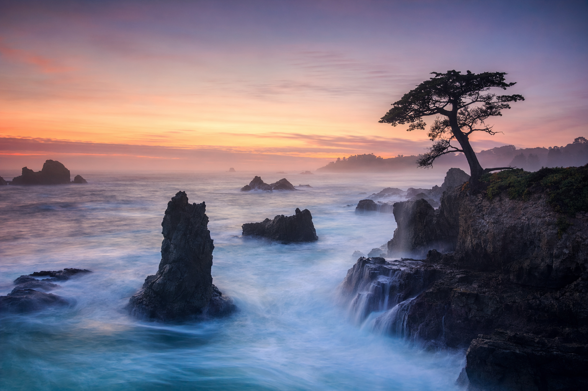
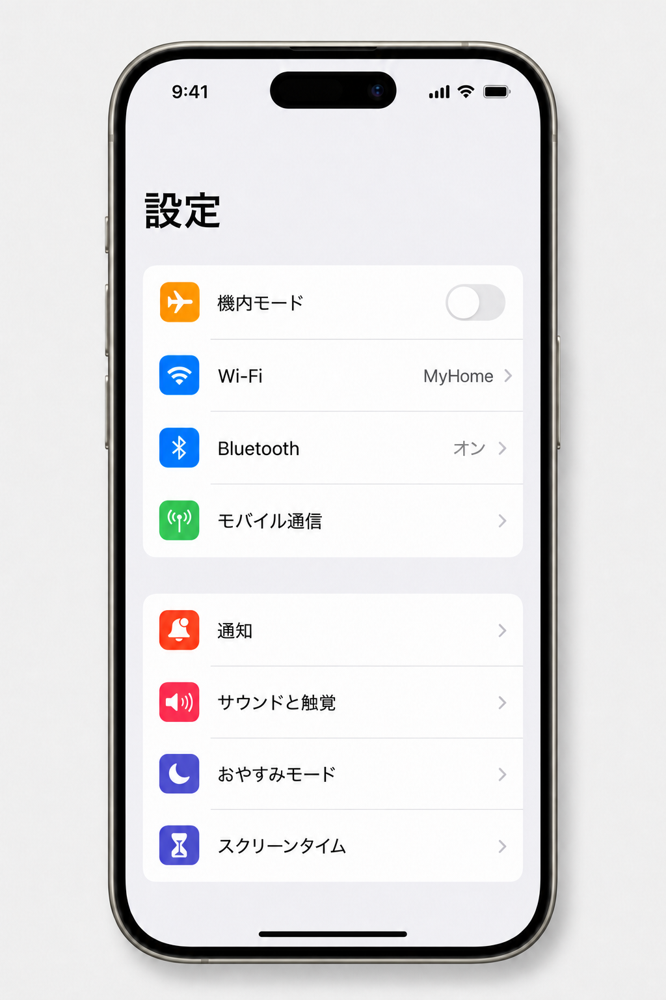

# ccskill-gptimage 画像生成スキル

[English README](README.md)

OpenAI **gpt-image-2** (ChatGPT Images 2.0) を使用した Claude Code 用画像生成スキルです。画像生成スクリプト単体としても使用できます。

## 特徴

プロンプトを明示的に指定する必要がなく、プロジェクト内の情報やコンテキストを踏まえた最適なプロンプトを自動生成し、Claude Code のセッション内で ChatGPT Images 2.0 を使用した画像生成を行います。

- **API キー不要** — ChatGPTのサブスクリプション契約と関連づけて使用できます。(4Kサイズの最大サイズや厳密なサイズ指定を伴う画像生成にはAPIキーが必要です)
- **多言語テキスト描画** — 日本語(漢字/かな/縦書き)・韓国語・中国語などの非ラテン文字が得意
- **参照画像で編集** — `--reference` で既存画像をベースに合成・部分修正
- **メタデータ自動保存** — プロンプト・revised_prompt・パラメータを JSON に記録

## 作例

本スキルを使って生成した画像の作例。全作例は [`docs/gallery.ja.md`](docs/gallery.ja.md) を参照。

<table>
<tr>
  <td align="center" width="33%"></td>
  <td align="center" width="33%"></td>
  <td align="center" width="33%"><a href="docs/gallery.ja.md"></a></td>
</tr>
<tr>
  <td align="center" width="33%"></td>
  <td align="center" width="33%"></td>
  <td align="center" width="33%"></td>
</tr>
</table>

## 必要環境

本スキルは2種類の使い方があります。使い方によって必要とする環境が異なります。`--backend` パラメタで両環境を切り替えながら使用することもできます。4Kサイズの画像生成やサイズ指定を厳密に行う場合はパターンBが必須ですので、併用が推奨されます。

**パターン A : ChatGPT サブスクリプション契約 + Codex CLI**
- Python 3.10 以上
- ChatGPT サブスクリプション契約 (Plus 以上)
- [Codex CLI](https://github.com/openai/codex) のインストールと `codex login` でのログイン

**パターン B : OpenAI API キー**
- Python 3.10 以上
- OpenAI API キー
- 組織認証 (Organization Verification)

## セットアップ
### 1. リポジトリのクローン
任意の箇所に clone します

```bash
cd /path/to/projects
git clone https://github.com/feedtailor/ccskill-gptimage.git
```

### 2. 画像生成のための準備

ChatGPT Images 2.0 を使えるようにします。使い方によって準備作業が異なりますので適切なほうを選んでください。推奨はパターンA/Bの併用です。

#### パターン A : ChatGPT サブスクリプション契約 + Codex CLI
(すでにサブスクリプション連携して Codex CLI を使用している場合は不要です)

```bash
# Codex CLI をインストール(Homebrew)
brew install codex
# ChatGPT アカウントでログイン
codex login
```

#### パターン B : OpenAI API キー
[OpenAI Platform](https://platform.openai.com/) で以下の設定が必要です。

- (a) [API keys](https://platform.openai.com/api-keys) にアクセスして API キーを発行
- (b) [Organization Settings](https://platform.openai.com/settings/organization/general) の [General]→[Verification] で認証を行う

上記の設定を終えたら、`.env` ファイルに API キーを記述します。

```bash
cp .env.example .env
```

`.env` に (a) で取得した API キーを記載
```
OPENAI_API_KEY=sk-...
```

### 3. インストーラーの実行

ccskill-gptimage を `git clone` したディレクトリに移動し、以下を実行します。

```bash
cd /path/to/ccskill-gptimage
./install.sh
```

インストーラーが以下を全て行います:

- Python venv の作成と依存パッケージのインストール
- `ccskill-gptimage` コマンドを `~/.local/bin` に配備(PATH に無い場合は追記手順を案内)
- ユーザレベルスキルとして登録(`~/.claude/skills/ccskill-gptimage`)— **全ての** Claude Code プロジェクトから使えるようになり、プロジェクト毎の設定は不要です
- backend(Codex CLI / API キー)の利用可否を診断表示

再実行しても安全です(冪等)。

## 使い方

任意の Claude Code プロジェクトで、ChatGPT Images 2.0 を使って画像生成するよう指示をするか、明示的に `/ccskill-gptimage` をプロンプトに入力して下さい。

詳細なプロンプトを自分で書かなくても、Claude Code が会話文脈やプロジェクト内の情報から最適なプロンプトを組み立て、適切なオプションを選んで画像生成します。


## 更新
以下の通り本スキルを clone した箇所で `git pull` してください。スキル登録もコマンドも clone 先への symlink なので、自動的に更新が反映されます。

```bash
cd /path/to/ccskill-gptimage
git pull
```

## アンインストール

```bash
ccskill-gptimage uninstall
```

symlink(`~/.local/bin/ccskill-gptimage` と `~/.claude/skills/ccskill-gptimage`)を除去します。clone したリポジトリ自体は残ります。

## コマンドラインから単体で使う場合

任意のディレクトリから画像生成コマンドとして使用することもできます。

```bash
ccskill-gptimage generate "夕焼けの海岸線"
```

### 指定可能なオプション

| オプション | 説明 | デフォルト |
|---|---|---|
| `--size` | 出力サイズ: `auto` または自由な `WxH`(制約は下記)。プリセット `1024x1024`/`1024x1536`/`1536x1024`、最大 `3840x2160`(4K) | `1024x1024` |
| `--quality` | 品質 (`auto`/`low`/`medium`/`high`) | `auto` |
| `--background` | 背景 (`auto`/`opaque`)。`transparent` は gpt-image-2 未対応(`gpt-image-1.5` で対応) | `auto` |
| `--output-format` | 出力形式 (`png`/`jpeg`/`webp`) | `png` |
| `--output-compression` | 圧縮率 (jpeg/webp 時 0-100) | なし |
| `--output` | 出力ディレクトリ | `./generated_images` |
| `--reference` | 参照画像 (複数指定可) | なし |
| `--mask` | マスク画像 (透明部分が編集対象) | なし |
| `--input-fidelity` | gpt-image-2 では指定不要(常に最大忠実度)。`gpt-image-1.5` 用 | なし |
| `--moderation` | モデレーション (`auto`/`low`) | `auto` |
| `--backend` | 画像生成 backend (`auto`/`codex`/`api`)。`auto` は Codex 優先、失敗時 API フォールバック | `auto` |

### 使用例

```bash
# 基本
ccskill-gptimage generate "A minimalist fox logo, flat vector, navy and gold"

# 日本語ポスター
ccskill-gptimage generate 'A minimalist editorial poster with the exact title "腹落ちDMARC" in large serif Japanese font, dark navy background' --size 1024x1536 --quality high

# 参照画像をベースに編集(背景置換)
ccskill-gptimage generate "Place the same fox logo on a deep navy background with subtle gold sparkles. Preserve the fox's pose and proportions from the reference." --reference ./logo.png --quality medium

# 複数参照を合成
ccskill-gptimage generate "Photorealistic gift basket on white" --reference ./a.png --reference ./b.png --reference ./c.png

# マスク誘導編集(--backend api 必須)
ccskill-gptimage generate "A sunlit indoor lounge with a pool" --reference ./lounge.png --mask ./mask.png --backend api
```

### 出力ファイル

各画像と並列に **メタデータ JSON** (`{画像名}.{ext}.json`) が保存され、再現/微調整に使えます:
```json
{
  "model": "gpt-image-2",
  "prompt": "...",
  "revised_prompt": "...",
  "size": "1024x1024",
  "quality": "high",
  "timestamp": "2026-04-23T10:00:00"
}
```

## 仕様

- **モデル**: `gpt-image-2`(`gpt-image-2-2026-04-21` スナップショット)
- **入力**: テキスト / 画像
- **出力**: 画像のみ(`b64_json` 形式、URLは返らない)
- **最大解像度**: 4K(最大辺 3840px)対応。`--size` は自由な `WxH` を受け付け、モデルの制約(各辺 16 の倍数 / 最大辺 3840px / アスペクト比 3:1 以下 / 総ピクセル 655,360〜8,294,400)で検証する。`--backend api` は厳密にサイズを守る(例 `3840x2160`)。`--backend codex` は非決定的(サイズ非保証)
- **エンドポイント**: `/v1/images/generations`, `/v1/images/edits`
- **ファイル名**: タイムスタンプ形式 (例: `20260423_153045.png`)
- **モデレーション**: `auto`(デフォルト) / `low`

## トラブルシューティング

`ccskill-gptimage doctor` で環境と backend を手早く診断できます。秘密ファイル(`.env` / Codex 認証)の中身は一切読まず、判定は presence ベースです(確証は実際に生成した時)。

| エラー表示 | 対処 |
|---|---|
| `403 Forbidden` | OpenAI Organization Verification が未完了 → Organization Settings で完了させる |
| 原因が分からない | `ccskill-gptimage doctor` を実行 |

## ライセンス

MIT
