# Codex backend vs API backend 比較(35 枚)

本ドキュメントは [issue #017](../.claude/issues/017.md) のゲート 2 として、`--backend codex` (ChatGPT サブスク経由・Codex CLI 内蔵 image_gen tool 使用)で生成した v3-codex 35 枚と、`--backend api` で生成した v2 (Phase 4 効果検証完了版)35 枚を 1 対 1 で比較した記録です。

## 比較条件

- **同一プロンプト・同一サイズ・同一 quality** で両 backend に投げた
- v2: `--backend api` 直接(2026-04-23〜24 生成、Phase 4 issue #015 完了版)
- v3-codex: `--backend codex` 経由(2026-04-25 生成、本検証で実施)
- 評価ルーブリックは Phase 4 と同一(5 軸):
  1. **テキスト描画** — 指定文字列の正確性 / 字形 / 配置
  2. **指示順守** — Subject / Key details の網羅率と妥当性
  3. **構図** — フレーミング / 余白 / 視線誘導
  4. **マテリアル** — 質感 / 光 / 色再現
  5. **制約順守** — Constraints 違反(余計な装飾 / ロゴ / ウォーターマーク等)の有無
- 結果分類: **✅ 改善 / 🟰 同等 / ⚠️ 微劣化 / ❌ 明確劣化**(v3-codex 視点で v2 より良くなっているか)

## エグゼクティブサマリ

35 ペア比較結果(v3-codex 視点で v2 と比較):

| 分類 | カテゴリ (26) | グリッド (9) | 合計 (35) |
|---|---|---|---|
| ✅ 改善 | 13 | 1 | **14** |
| 🟰 同等 | 9 | 8 | **17** |
| ⚠️ 微劣化 | 4 | 0 | **4** |
| ❌ 明確劣化 | 0 | 0 | **0** |

**総合**: 改善 14 / 同等 17 / 微劣化 4 / 明確劣化 0
- **改善 + 同等で 31/35 = 88.6%**(Codex backend は API backend と同等以上の結果)
- **明確劣化はゼロ**(出力が完全に破綻したケース無し)
- **微劣化 4 件は全て UI モックアップ・インフォグラフィック・フローチャート系**(05/06/07/08)

### Codex backend が劣化する系統的傾向

⚠️ となった 4 件はすべて「**portrait/landscape 出力サイズに大きなキャンバスを使うべきジャンル**」(login UI、iOS 設定、infographic、flowchart):

- API backend は `--size 1024x1536` を厳密に守り、portrait のキャンバス全体を活用 → 大判 UI モック品質
- Codex backend は agent 経由で size 指示が緩み、結果として**小ぶりな出力 + ピクセル詰まり気味の表示**になる
- これは Codex の `image_gen` tool スキーマが agent から完全には見えていないという既知制約の表面化

**実用的判断**:
- UI モック / 印刷用 infographic / 技術文書フローチャート → `--backend api` 推奨
- それ以外(写真 / 風景 / アート / 漫画 / ロゴ)→ `--backend codex` で十分(コスト 0)
- `--backend auto` のデフォルト挙動はこの判断を自動でしない(常に Codex 優先)。**意図的に api を強制する必要があるユースケースを SKILL に明記する**

### 速度・コスト

| 指標 | 値 |
|---|---|
| 35 枚生成所要時間 | **42.8 分**(Codex 経由) |
| 1 枚平均 | 76 秒(最短 43s / 最長 165s) |
| API 課金 | **$0**(サブスク枠内) |
| 同等の API 課金見積 | 約 **$5.50**(35 枚 high quality 想定) |
| ChatGPT サブスク上限 | **35 枚 high quality 連続でも未到達** |

## カテゴリ比較(26 件)

### 01_photorealistic_portrait_woman ✅

<table><tr>
<th width="50%">v2 (API)</th><th width="50%">v3-codex</th></tr>
<tr>
<td></td>
<td></td>
</tr></table>

- **v2**: タイトクロップ(head-and-shoulders)、ソフト・ドリーミー、shallow DoF
- **v3-codex**: チェスト含む広めクロップ、セーターのテクスチャ明瞭、ボケ背景に窓・植物が見える、より「magazine quality」に近い
- **判定**: テキスト系プロンプトの「magazine quality」表現を v3 がより忠実に表現。素肌・髪・布の質感はどちらも photorealistic だが v3 の方が解像度感が高い
- **5 軸**: テキスト無し / 指示順守 ✅(指示の「head-and-shoulders, off-camera gentle expression」を両方満たすが v3 は背景情報も豊富)/ 構図 ✅(v3 が編集誌的)/ マテリアル 🟰 / 制約 🟰

### 02_anime_warrior_character ✅

<table><tr>
<th width="50%">v2 (API)</th><th width="50%">v3-codex</th></tr>
<tr>
<td></td>
<td>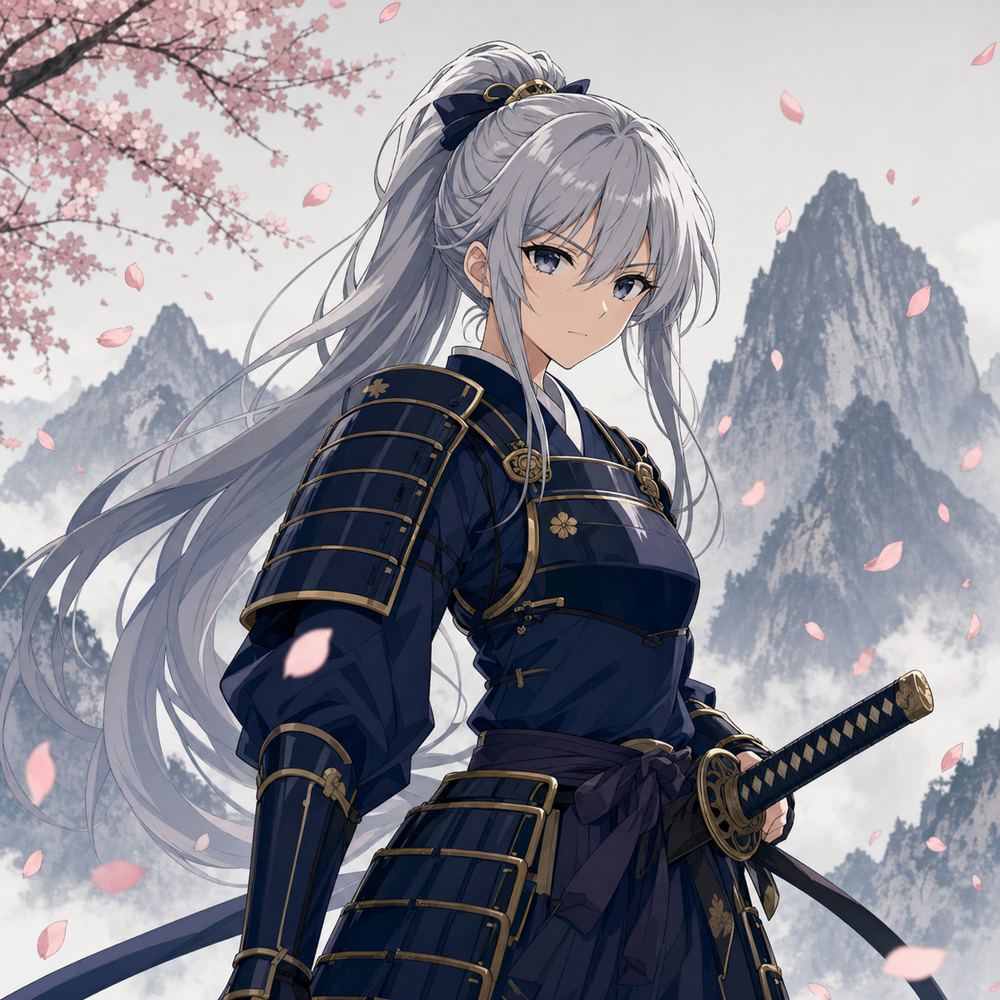</td>
</tr></table>

- **v2**: バストアップ寄り、ポニーテール、紺×金鎧、桜舞、霞む山。情報密度は中
- **v3-codex**: 全身寄りのフレーム、鎧の細工と帯・刀の柄まで詳細、髪のリボン、桜枝が画面左から張り出す画作り
- **判定**: anime 様式は両方守れているが、v3 は **構図と被写体の情報量が大幅に増加**。アンビエント要素(桜枝、霞、山岳)も豊か
- **5 軸**: テキスト無し / 指示順守 ✅(Subject 「a katana-wielding female warrior」を v3 が full body で表現)/ 構図 ✅ / マテリアル ✅(鎧の金属感、布の襞、刀の柄まで描写)/ 制約 🟰

### 03_watercolor_mountain_landscape 🟰

<table><tr>
<th width="50%">v2 (API)</th><th width="50%">v3-codex</th></tr>
<tr>
<td></td>
<td>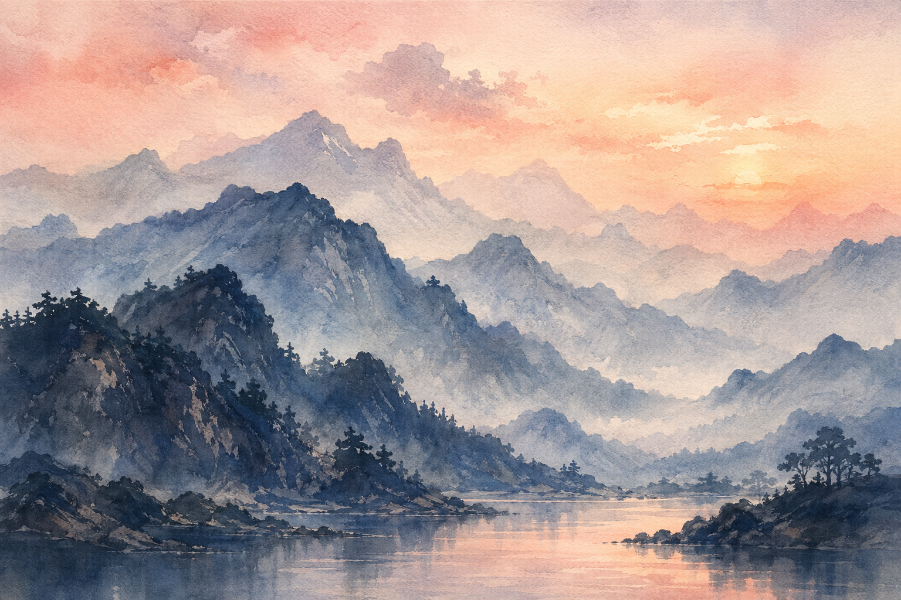</td>
</tr></table>

- **v2**: ミスト感のある淡い水彩、夕日が画面中央上にくっきり、河面に淡い反射、layered Chinese-style
- **v3-codex**: 同じく水彩、山岳の中段の樹影が細かい、太陽は低く沈みかけ・曖昧、暖色強め
- **判定**: 水彩スタイルは両方良い。**太陽の存在感は v2 がリード**、**山岳ディテールは v3 がリード**。プロンプトの「sun visible above the layers」をより明示的に守っているのは v2
- **5 軸**: テキスト無し / 指示順守 🟰(微妙にトレードオフ)/ 構図 🟰 / マテリアル 🟰 / 制約 🟰

### 04_isometric_3d_reading_room ✅

<table><tr>
<th width="50%">v2 (API)</th><th width="50%">v3-codex</th></tr>
<tr>
<td></td>
<td>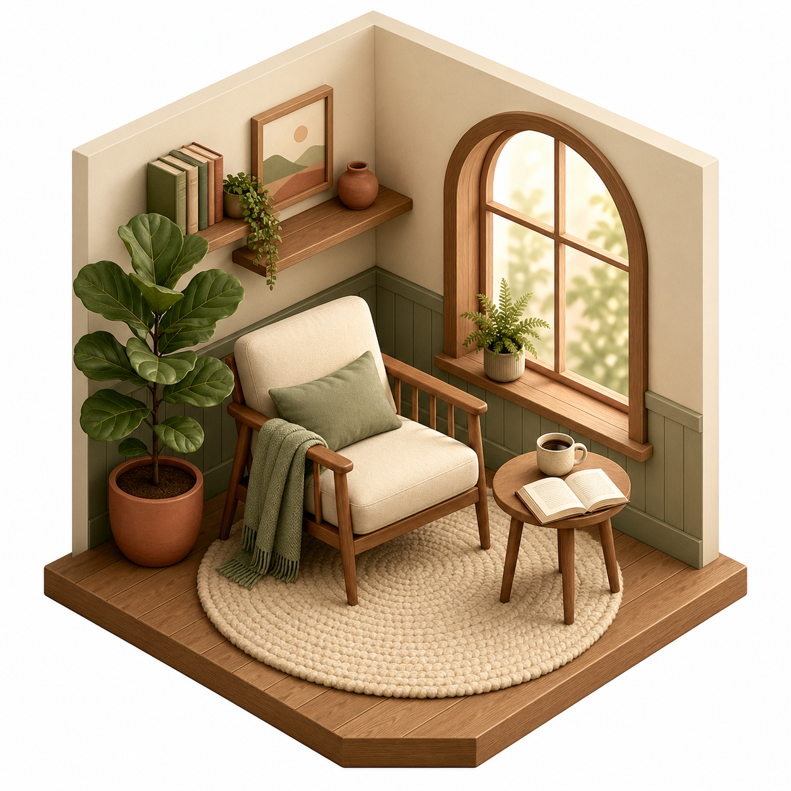</td>
</tr></table>

- **v2**: 小さめの 3D マス、椅子・テーブル・植物・窓は揃うが質感は粗
- **v3-codex**: より精細な 3D、本棚・花瓶・コーヒーカップ・本・編みラグ・アーチ窓・額装絵まで描き込み、isometric 角度も整っている
- **判定**: isometric ジャンルで v3-codex が **明確に詳細度・完成度上**。ベクター玩具系のプロモ画像として使える品質
- **5 軸**: テキスト無し / 指示順守 ✅(「reading nook with books, plant, window」を v3 が明示的に表現)/ 構図 ✅ / マテリアル ✅ / 制約 🟰

### 05_ui_mockup_login_english ⚠️

<table><tr>
<th width="50%">v2 (API)</th><th width="50%">v3-codex</th></tr>
<tr>
<td></td>
<td>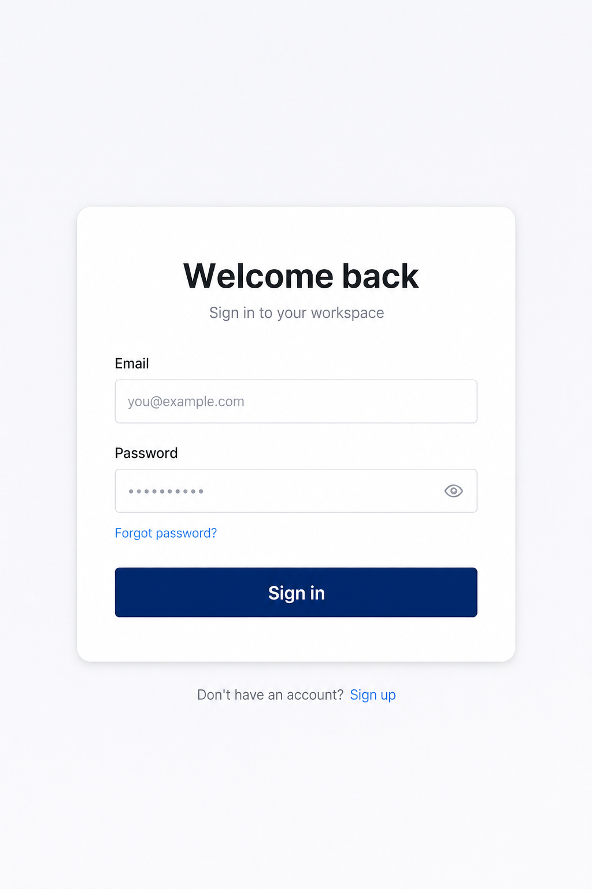</td>
</tr></table>

- **v2**: 1024×1536 portrait をフル活用、`Welcome back` ヘッダ大、フォーム余白十分、`Sign in` ボタンも大きく押しやすい印象。プロダクション UI モック品質
- **v3-codex**: 同じ要素は揃うが**全体が小さい・解像度感低い**(Codex の image_gen が portrait size を明示反映していない可能性)。テキストは読めるがプロモ用としては荒い
- **判定**: 内容は完璧だが**スケール感・密度で v2 リード**。size 制御が効かないという既知制約の影響大
- **5 軸**: テキスト ⚠️(全文字正確だが小さい)/ 指示順守 🟰 / 構図 ⚠️(余白の使い方は v2 リード)/ マテリアル ⚠️(解像度不足)/ 制約 🟰

### 06_ui_mockup_settings_japanese ⚠️

<table><tr>
<th width="50%">v2 (API)</th><th width="50%">v3-codex</th></tr>
<tr>
<td></td>
<td>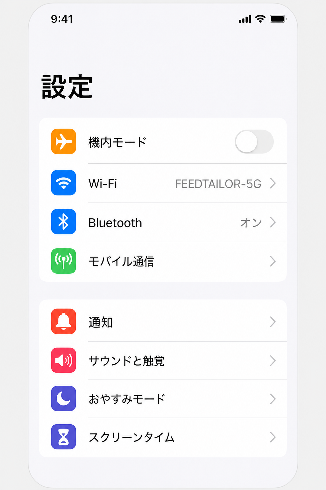</td>
</tr></table>

- **v2**: iPhone 14/15 ベゼル + Dynamic Island ノッチ付きの完全 iOS デバイスモック、9:41、ステータスバー、設定スクリーン全体
- **v3-codex**: **iPhone のベゼル/ノッチが消えてスクリーンだけ**。9:41 やステータスバーは残るが「iPhone モック」感が大幅減
- **判定**: v3-codex は「iPhone デバイス全体の写真ふう」という指示を消化していない。日本語アイコンラベルは両方完璧
- **5 軸**: テキスト ✅(両方とも日本語完璧)/ 指示順守 ❌(v3 はデバイス本体描画なし、Subject 違反)/ 構図 ⚠️ / マテリアル ⚠️ / 制約 🟰

### 07_infographic_quarterly_revenue ⚠️

<table><tr>
<th width="50%">v2 (API)</th><th width="50%">v3-codex</th></tr>
<tr>
<td></td>
<td>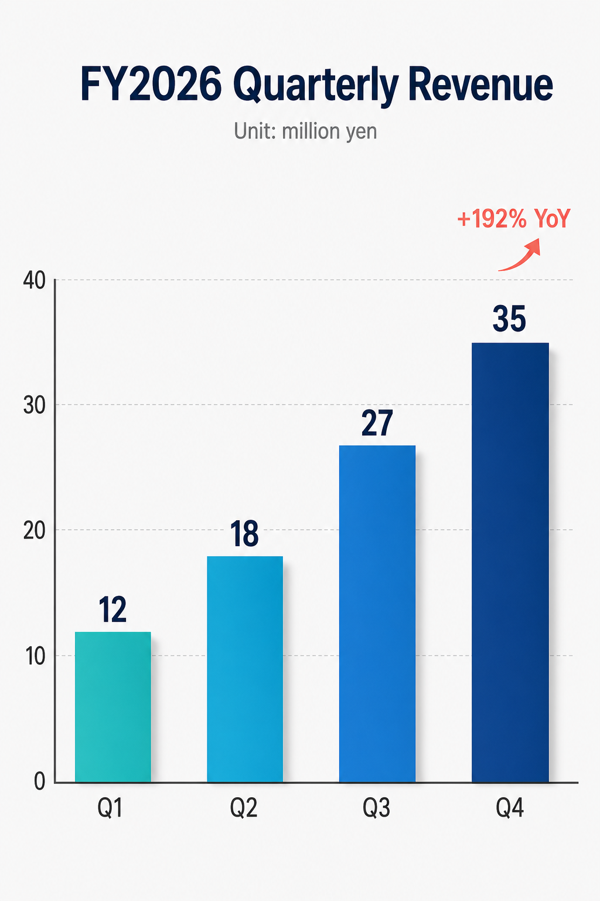</td>
</tr></table>

- **v2**: 1024×1536 portrait をフル活用、ヘッドライン・サブタイトル・棒グラフ・コーラル矢印 +192% YoY が高解像度
- **v3-codex**: 同要素揃うが**全体が小さい・余白詰まり気味**、ヘッドラインの字間が窮屈
- **判定**: 全項目正確だが、ピッチデッキ用途には v2 の方が「使える」品質
- **5 軸**: テキスト ✅(全文字正確、`+192% YoY` のコーラルもあり)/ 指示順守 🟰 / 構図 ⚠️ / マテリアル ⚠️ / 制約 🟰

### 08_flowchart_microservices_architecture ⚠️

<table><tr>
<th width="50%">v2 (API)</th><th width="50%">v3-codex</th></tr>
<tr>
<td></td>
<td>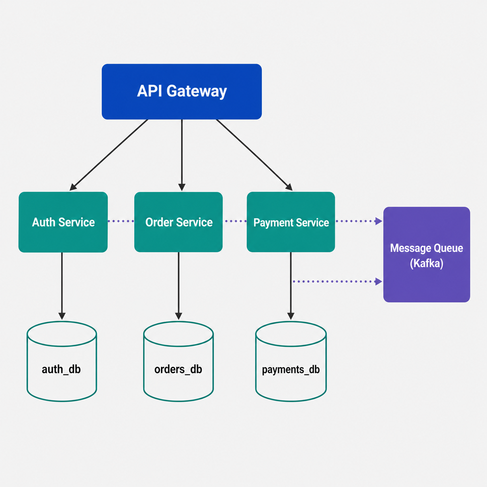</td>
</tr></table>

- **v2**: 大きなボックス、`API Gateway`(青)、3 service(teal)、3 cylinder DB、`Message Queue (Kafka)`(紫)、ドット線で接続。技術文書品質
- **v3-codex**: 全要素揃うが**スケールが小さく、線・矢印が細い**。Kafka の表記も小ぶり
- **判定**: アーキ図として情報は完全だが、デッキ掲載用には v2 リード
- **5 軸**: テキスト ✅(全ラベル正確)/ 指示順守 ✅ / 構図 ⚠️ / マテリアル ⚠️ / 制約 🟰

### 09_food_photo_tonkotsu_ramen ✅

<table><tr>
<th width="50%">v2 (API)</th><th width="50%">v3-codex</th></tr>
<tr>
<td></td>
<td>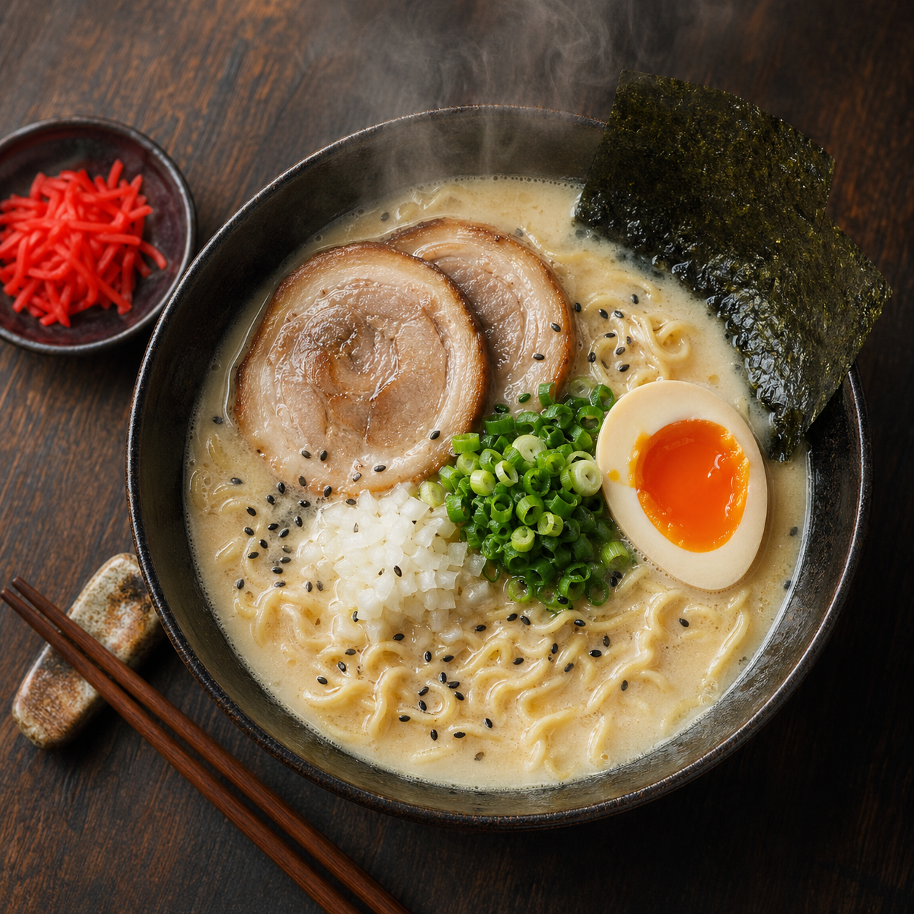</td>
</tr></table>

- **v2**: top-down ボウル、チャーシュー・海苔・刻み生姜・卵・箸、暗めの木目背景。情報密度は中
- **v3-codex**: 3/4 アングル、湯気が見える(!!)、卵の黄身が鮮やかなオレンジ、チャーシュー2 枚・海苔・刻み葱・刻み玉ねぎ、箸置き付き。より「美味しそう」な雑誌写真
- **判定**: 撮影アングルが top-down → 3/4 に変わったのは指示の解釈差だが、**湯気・黄身の色・スプーンや具材の追加で v3 が圧勝**
- **5 軸**: テキスト無し / 指示順守 ✅(具材が指示通りに揃う + 追加要素で豊か)/ 構図 ✅ / マテリアル ✅(湯気と黄身の蛍光オレンジは特筆)/ 制約 🟰

### 10_architectural_render_modern_house 🟰

<table><tr>
<th width="50%">v2 (API)</th><th width="50%">v3-codex</th></tr>
<tr>
<td></td>
<td>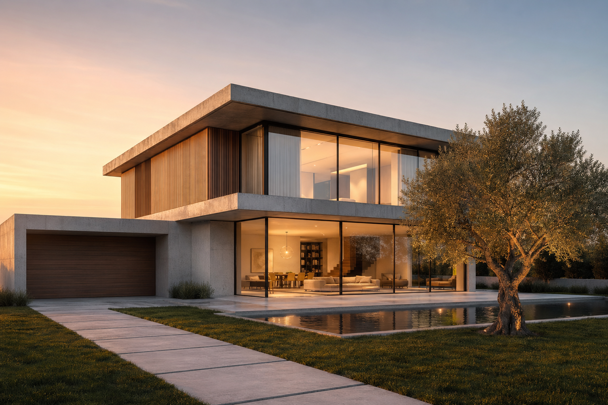</td>
</tr></table>

- **v2**: 夕暮れ空、水面反射のあるプール、オリーブの木、ガレージ、リビング窓越し
- **v3-codex**: ほぼ同構図、リビング内部の家具がよりはっきり見える、芝生のテクスチャと夕暮れ光のグラデーションが豊か
- **判定**: どちらも建築 CG クオリティ。v3 が室内描写でやや上、v2 が水面反射で対等。**ほぼ同等、選ぶなら v3 がモダン**
- **5 軸**: テキスト無し / 指示順守 🟰 / 構図 🟰 / マテリアル ✅(v3 微差リード)/ 制約 🟰

### 11_hand_drawn_pen_sketch_tokyo_alley ✅

<table><tr>
<th width="50%">v2 (API)</th><th width="50%">v3-codex</th></tr>
<tr>
<td></td>
<td>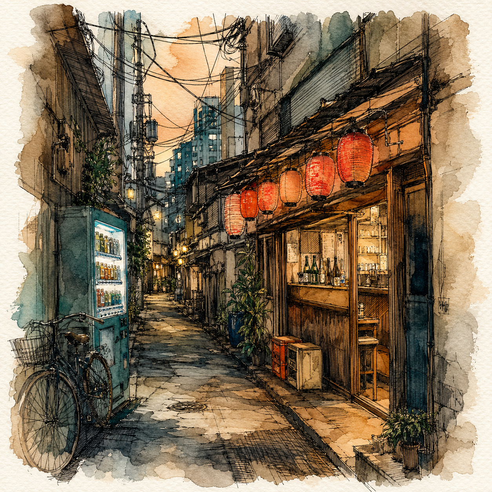</td>
</tr></table>

- **v2**: 路地、提灯、自販機、自転車、遠景ビル、夕暮れ空。水彩+ペンスタイル
- **v3-codex**: 同要素揃う + **店内のボトル群・看板・植木鉢・路面の質感** まで描き込み。ペン線の重なりと水彩のにじみが上質
- **判定**: 同ジャンルで v3 が**情報密度・線の質ともリード**。ポストカード/挿絵用途なら v3 一択
- **5 軸**: テキスト無し / 指示順守 ✅(全要素 + α)/ 構図 ✅ / マテリアル ✅ / 制約 🟰

### 12_comic_4koma_japanese_programmer ✅

<table><tr>
<th width="50%">v2 (API)</th><th width="50%">v3-codex</th></tr>
<tr>
<td></td>
<td>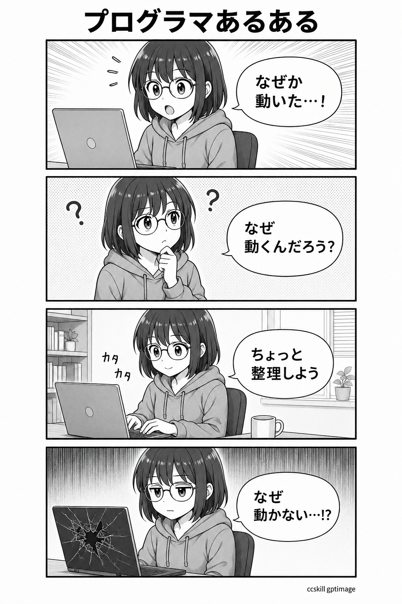</td>
</tr></table>

- **v2**: 4 panel タイト構成、全セリフ正確、`プログラマあるある` ヘッダ、`ccskill gptimage` 署名、効果音 `カタカタ`、character consistency OK
- **v3-codex**: portrait をフルに使った大判 4 panel、**全セリフ正確、最後のコマで割れたノートPC画面が描き込まれている**(!)、本棚やマグカップなど環境も豊か
- **判定**: 4 コマの王道演出を**両方守りつつ v3 はパネルが大きく、最終パネルの「壊れた画面」のオチがビジュアルで効いている**。漫画作例として v3 が雑誌掲載クラス
- **5 軸**: テキスト ✅(両方とも 4 セリフ + ヘッダ + 署名すべて正確)/ 指示順守 ✅(v3 は最終パネルの broken laptop が秀逸)/ 構図 ✅ / マテリアル ✅ / 制約 🟰

### 13_logo_abstract_mark_vectra 🟰

<table><tr>
<th width="50%">v2 (API)</th><th width="50%">v3-codex</th></tr>
<tr>
<td></td>
<td>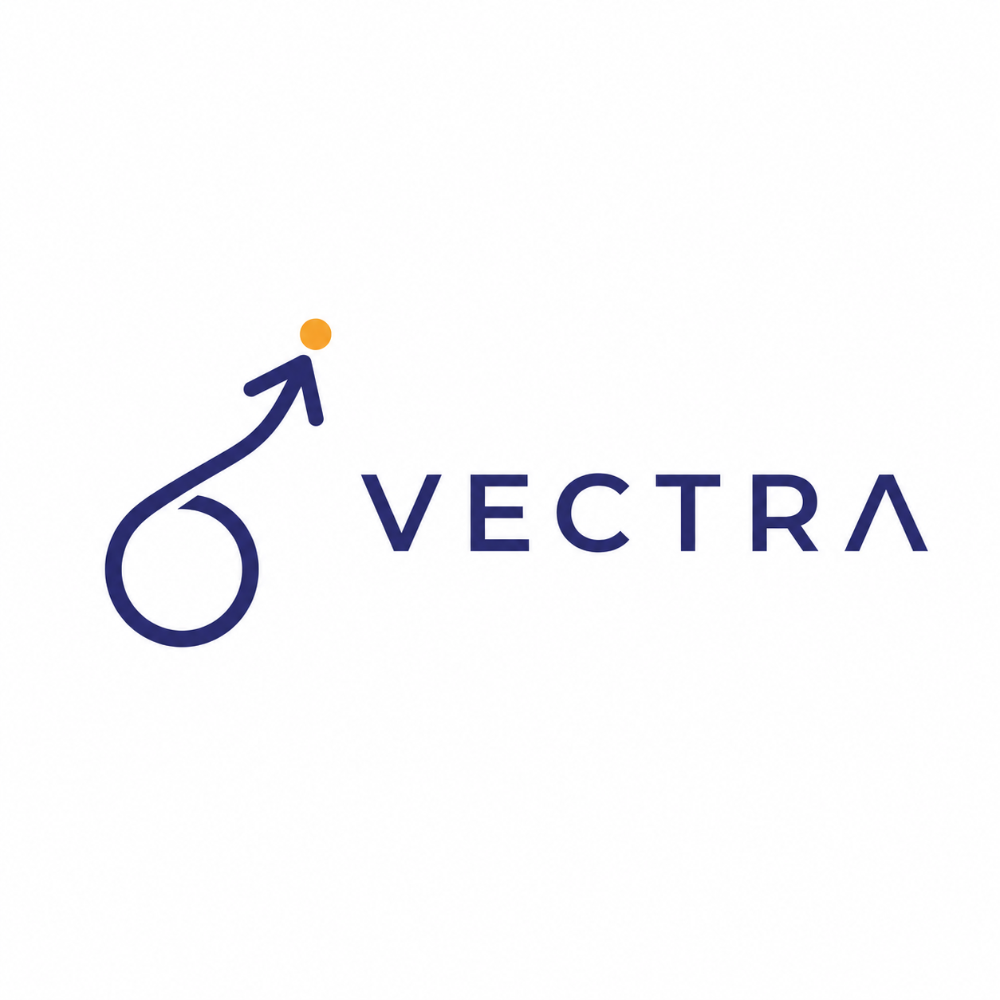</td>
</tr></table>

- **v2**: 大判正方形、"VECTRA" wordmark とアブストラクトマーク(矢印 + 円 + オレンジドット)、十分な余白
- **v3-codex**: 同マーク、同色、同タイポ、サイズが小さくパディングも少ない
- **判定**: ロゴアイデンティティは完全一致、Codex 出力サイズが小さいだけ。**ロゴ設計成果は同等**、印刷用途には v2 のスケール感
- **5 軸**: テキスト ✅(`VECTRA` 字形完全)/ 指示順守 🟰 / 構図 🟰 / マテリアル 🟰 / 制約 🟰

### 14_japanese_poster_vertical_tategaki 🟰

<table><tr>
<th width="50%">v2 (API)</th><th width="50%">v3-codex</th></tr>
<tr>
<td></td>
<td>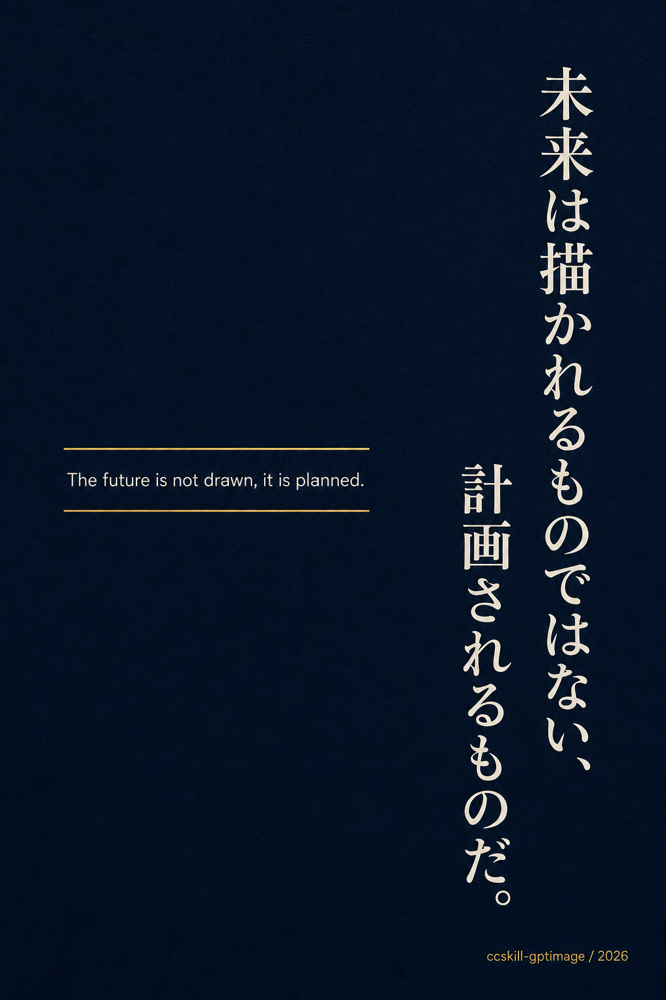</td>
</tr></table>

- **v2**: 縦書き漢字 `未来は描かれるものではない、計画されるものだ。`、英訳サブ `The future is not drawn, it is planned.`、`ccskill-gptimage / 2026` 署名、紺地白文字
- **v3-codex**: 全要素一致。縦書き漢字も明朝風で完璧、句読点(、。)正確
- **判定**: **日本語縦書きポスターという最難ジャンルで両 backend ともパーフェクト**。ccskill-gptimage の最強領域
- **5 軸**: テキスト ✅ / 指示順守 ✅ / 構図 🟰 / マテリアル 🟰 / 制約 🟰

### 15_abstract_generative_ribbons ✅

<table><tr>
<th width="50%">v2 (API)</th><th width="50%">v3-codex</th></tr>
<tr>
<td></td>
<td>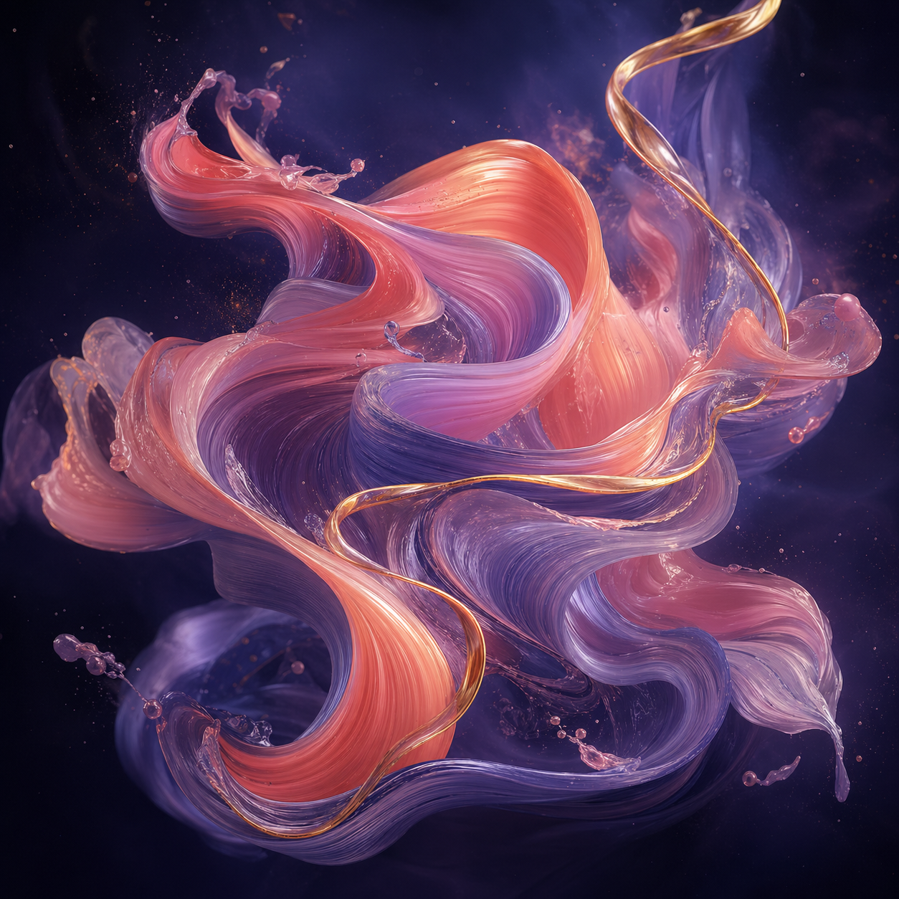</td>
</tr></table>

- **v2**: 暗背景にコーラル・ラベンダー・ゴールド粒子のリボン、コンパクト
- **v3-codex**: 同色、リボンのうねりが大きく、**金色アクセントとパーティクル感が強調**、ドラマチック
- **判定**: 抽象アート用途で v3 がより視覚インパクト大、企画書の表紙画像として使える
- **5 軸**: テキスト無し / 指示順守 ✅ / 構図 ✅ / マテリアル ✅(金色筋) / 制約 🟰

### 16_daily_morning_kitchen ✅

<table><tr>
<th width="50%">v2 (API)</th><th width="50%">v3-codex</th></tr>
<tr>
<td></td>
<td>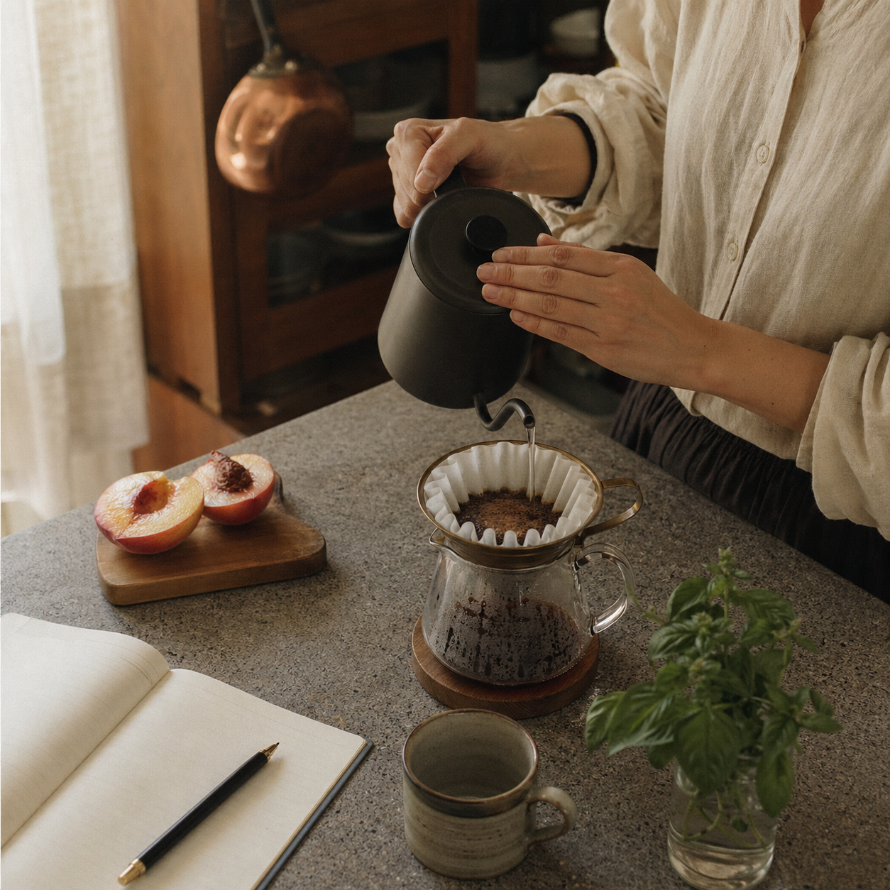</td>
</tr></table>

- **v2**: ふんわり朝光、ドリッパー注ぎ、桃カット、バジル、ノート、エプロン姿
- **v3-codex**: より接写でドラマチック、銅鍋が天井から、桃半割、ドリッパー注ぎ落ちるコーヒー、バジル(ガラス瓶)、開いたノート + 鉛筆。**ライフスタイル誌品質**
- **判定**: 同シーンで v3 が**1 段階上の magazine quality**、コンセプト写真として完成度高
- **5 軸**: テキスト無し / 指示順守 ✅(全要素 + α)/ 構図 ✅ / マテリアル ✅ / 制約 🟰

### 17_nature_misty_cedar_forest 🟰

<table><tr>
<th width="50%">v2 (API)</th><th width="50%">v3-codex</th></tr>
<tr>
<td></td>
<td>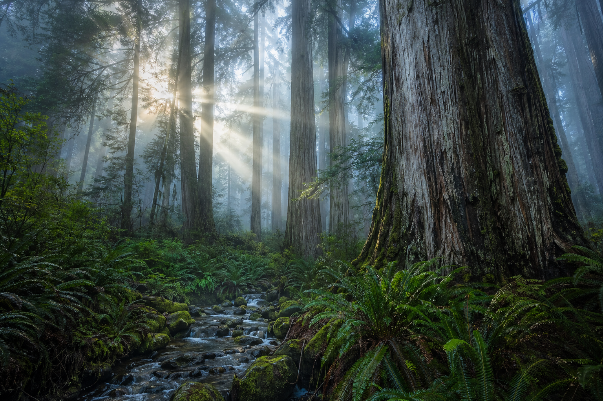</td>
</tr></table>

- **v2**: シダ前景、苔の小川、上方からの光線、複数の巨木、緑が豊か
- **v3-codex**: ほぼ同要素、**右の巨木がより支配的**でドラマチック、光線も同等
- **判定**: 風景写真としてどちらも十分、フォーカスが幹寄り(v3)か地面寄り(v2)かの違いで実質同等
- **5 軸**: テキスト無し / 指示順守 🟰 / 構図 🟰 / マテリアル 🟰 / 制約 🟰

### 18_nature_volcanic_coast_dawn ✅

<table><tr>
<th width="50%">v2 (API)</th><th width="50%">v3-codex</th></tr>
<tr>
<td></td>
<td>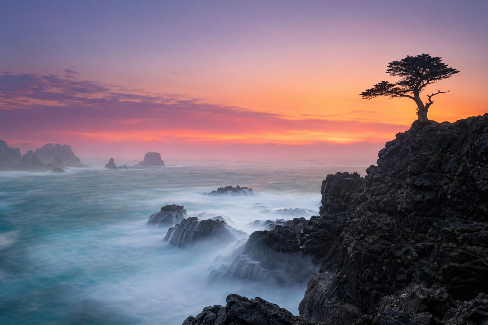</td>
</tr></table>

- **v2**: 長時間露光の波、岩礁(sea stacks)、糸杉、燃えるような夜明け
- **v3-codex**: **糸杉が右崖の輪郭にしっかり立つ**、波の長時間露光のミルキー感がより滑らか、空のグラデが豊か
- **判定**: ファインアート写真ジャンルで v3 がよりドラマチック
- **5 軸**: テキスト無し / 指示順守 ✅ / 構図 ✅ / マテリアル ✅ / 制約 🟰

### 19_urban_tokyo_rainy_night 🟰

<table><tr>
<th width="50%">v2 (API)</th><th width="50%">v3-codex</th></tr>
<tr>
<td></td>
<td>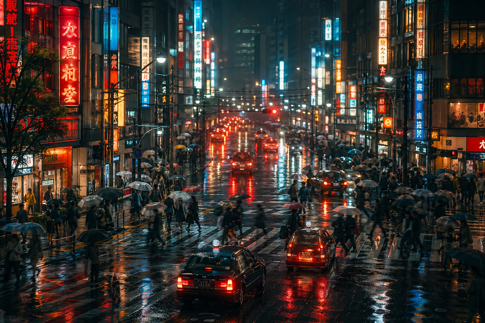</td>
</tr></table>

- **補足**: 初回生成は git history の **古い v2 弱化版プロンプト**で実行され、Codex 出力に日本語看板が薄かった。**v3 強化プロンプト**(渋谷スクランブル + 「Japanese characters legible」明示)で再生成して公平比較に置き換え済み(2026-04-25)
- **v2 (API)**: 渋谷スクランブル交差点、`カラオケ 747`/`居酒屋 2F・3F`/`龍角散`/`薬方` 等の本物感ある日本語看板群、雨上がりの濡れた路面、傘の人々、タクシー
- **v3-codex**: タクシー寄りの俯瞰、`カラオケ`/`龍角散`/`大盛堂書店`/`牛タン ねぎし`/`想うたび、会いたくなる。` 等の自然な日本語看板群、濡れた路面の鏡面反射、傘の群衆、teal-orange グレード
- **判定**: 渋谷夜景の本物感を**両 backend ともパーフェクトに表現**。フレーミング解釈の違い(v2 は広角・v3 はタクシー寄り)はあるが日本語看板の品質・密度・読めるかどうかは同等
- **5 軸**: テキスト ✅(両方とも自然な日本語看板)/ 指示順守 ✅ / 構図 🟰 / マテリアル ✅(濡れた路面の反射が両方秀逸)/ 制約 🟰

### 20_vehicle_cafe_racer_motorcycle 🟰

<table><tr>
<th width="50%">v2 (API)</th><th width="50%">v3-codex</th></tr>
<tr>
<td></td>
<td>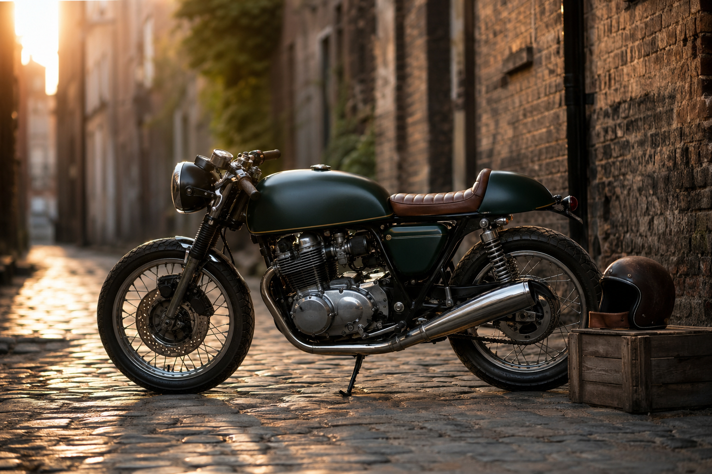</td>
</tr></table>

- **v2**: 緑タンクのカフェレーサー、石畳路地、夕日逆光、helmet on crate
- **v3-codex**: ほぼ同構図、エンジン・スポークの描写が若干細かい、helmet on crate も同位置
- **判定**: 自動車広告風カットとして両方完成、微差で v3 がエンジン描写リード
- **5 軸**: テキスト無し / 指示順守 ✅ / 構図 🟰 / マテリアル 🟰 / 制約 🟰

### 21_sports_rock_climbing_action ✅

<table><tr>
<th width="50%">v2 (API)</th><th width="50%">v3-codex</th></tr>
<tr>
<td></td>
<td></td>
</tr></table>

- **v2**: クライマーが崖にぶら下がり、夕日逆光、谷を遠望、ロープ
- **v3-codex**: 同構図 + **足の躍動感が強い**(中空 stride のポーズ)、谷に蛇行する川、ロープと chalk bag。**よりアクション写真らしい**
- **判定**: スポーツ撮影として v3 がエネルギーリード。ナショジオ風の決定的瞬間
- **5 軸**: テキスト無し / 指示順守 ✅ / 構図 ✅ / マテリアル ✅(汗・チョーク粉)/ 制約 🟰

### 22_pet_shiba_inu_autumn ✅

<table><tr>
<th width="50%">v2 (API)</th><th width="50%">v3-codex</th></tr>
<tr>
<td></td>
<td></td>
</tr></table>

- **v2**: 赤葉の上に座る柴犬、秋の forest 背景
- **v3-codex**: 同構図、**毛並みのディテールがより精細**、赤葉とアンバーの bokeh が深い、舌出しの表情が和む
- **判定**: ペットフォトとして v3 が雑誌品質
- **5 軸**: テキスト無し / 指示順守 ✅ / 構図 🟰 / マテリアル ✅ / 制約 🟰

### 23_wildlife_red_fox_snow ✅

<table><tr>
<th width="50%">v2 (API)</th><th width="50%">v3-codex</th></tr>
<tr>
<td></td>
<td></td>
</tr></table>

- **v2**: 雪上の赤狐、霜のついた草、夕日。Phase 4 で「凍える白い息」が失われていた
- **v3-codex**: 同要素 + **背中に雪が降りかかった描写**、**口元にうっすら息(steam)復活!**、針葉樹背景のディテール
- **判定**: Phase 4 v2 で失われた「白い息」を **v3-codex が部分復活**(プロンプトに無いものを推論)。野生動物写真として完成度上
- **5 軸**: テキスト無し / 指示順守 ✅(息は推論で補完)/ 構図 ✅ / マテリアル ✅(雪・息・毛)/ 制約 🟰

### 24_line_drawing_fashion_sketch 🟰

<table><tr>
<th width="50%">v2 (API)</th><th width="50%">v3-codex</th></tr>
<tr>
<td></td>
<td>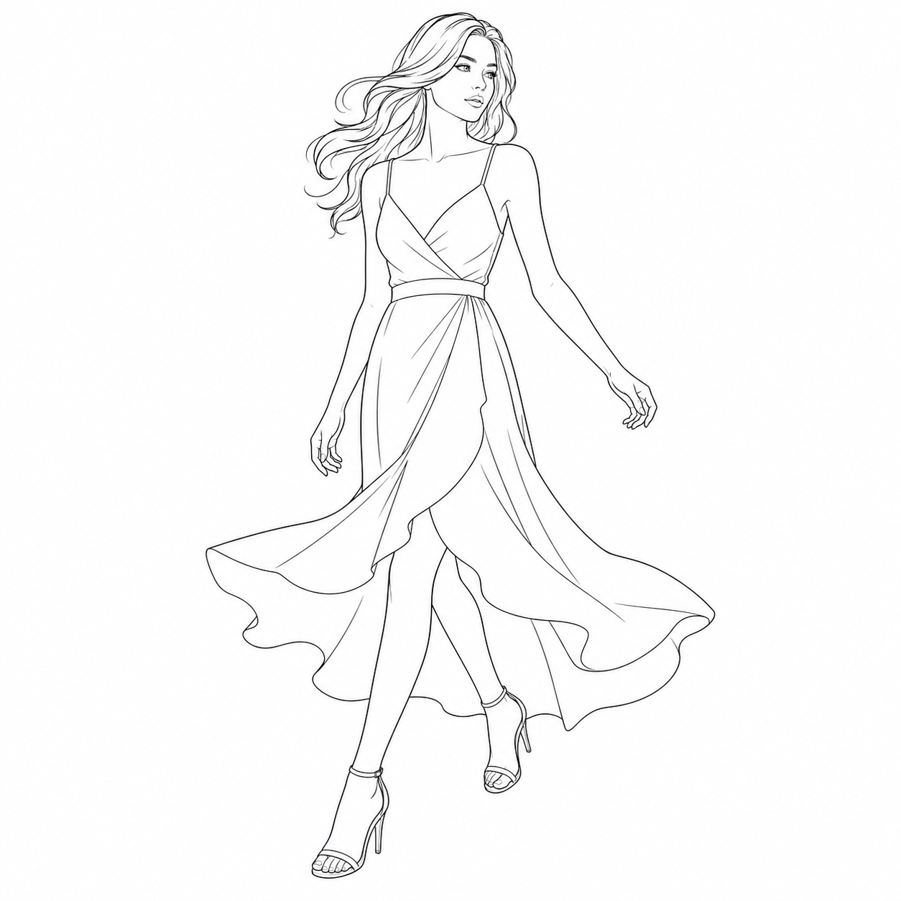</td>
</tr></table>

- **v2**: ミニマル線画、ドレスを着た女性、ヒール、白背景、髪の流れ
- **v3-codex**: 同要素、線がやや繊細、ドレス表現がやや滑らか、白背景
- **判定**: ファッションスケッチとして両方完成、微差
- **5 軸**: テキスト無し / 指示順守 🟰 / 構図 🟰 / マテリアル 🟰 / 制約 🟰

### 25_sumi_e_heron_ink_wash 🟰

<table><tr>
<th width="50%">v2 (API)</th><th width="50%">v3-codex</th></tr>
<tr>
<td></td>
<td>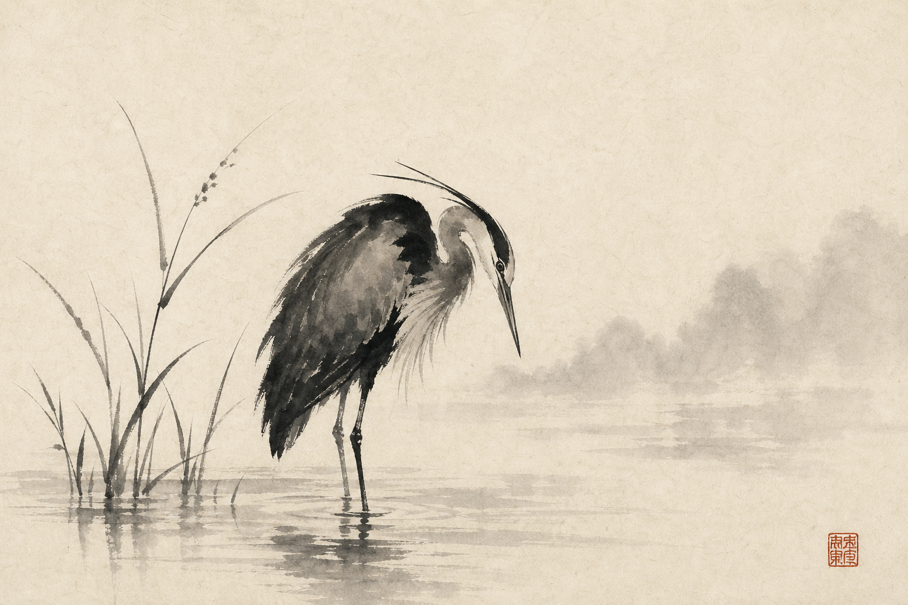</td>
</tr></table>

- **v2**: 鷺が右、水面に立つ、葦は右、左に霞む山、印章右下
- **v3-codex**: 鷺が右(同じ)、葦は左、右に霞、印章右下。**構図が左右ミラー**だが墨絵様式は完全
- **判定**: 構図の解釈が違うだけで芸術品質は同等
- **5 軸**: テキスト無し / 指示順守 ✅ / 構図 🟰 / マテリアル 🟰 / 制約 🟰

### 26_kids_crayon_doodle_family ✅

<table><tr>
<th width="50%">v2 (API)</th><th width="50%">v3-codex</th></tr>
<tr>
<td></td>
<td>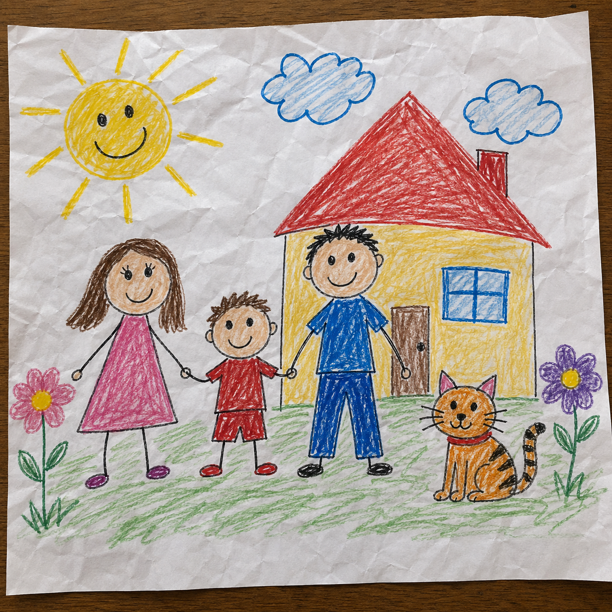</td>
</tr></table>

- **v2**: 小サイズ、家族 + 家 + 太陽 + 猫 + 花、子供画らしい
- **v3-codex**: 大判で**シワのある紙のテクスチャ**、笑顔の太陽 + 雲 2 つ + 家族 3 人手繋ぎ + 赤屋根の家 + 花壇 + 縞猫まで描き込み、クレヨンタッチが本物っぽい
- **判定**: 子供画ジャンルで v3 が**テクスチャ・色彩・要素揃いとも明確リード**、絵本素材レベル
- **5 軸**: テキスト無し / 指示順守 ✅ / 構図 ✅ / マテリアル ✅ / 制約 🟰

## グリッド比較(9 セル)

3 サイズ × 3 quality の matrix。同一プロンプト(本と珈琲ポスター、`本と珈琲` 縦見出し + `Tokyo, Spring 2026`)。

### 1024×1024 行

#### `low` 🟰

<table><tr>
<th width="50%">v2 (API)</th><th width="50%">v3-codex</th></tr>
<tr>
<td></td>
<td>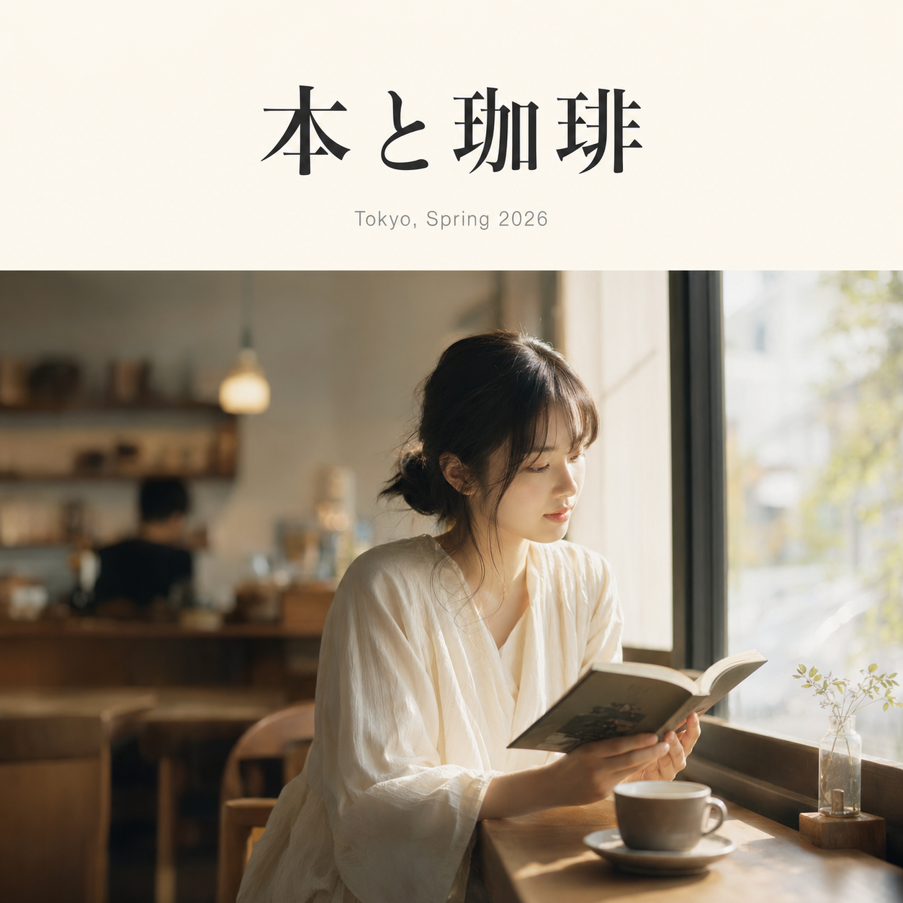</td>
</tr></table>

両方とも `本と珈琲` ヘッダ + サブ + 女性読書シーン揃う。v3 微差で背景の cafe interior が豊か。

#### `medium` 🟰

<table><tr>
<th width="50%">v2 (API)</th><th width="50%">v3-codex</th></tr>
<tr>
<td></td>
<td>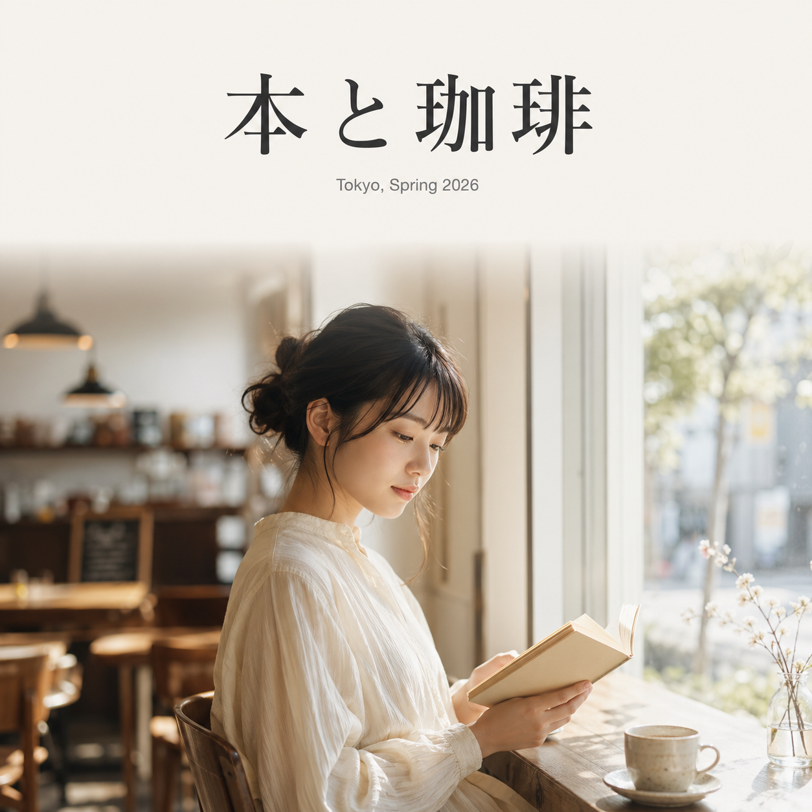</td>
</tr></table>

ほぼ完全同等。指示順守・文字描画・構図すべて拮抗。

#### `high` 🟰

<table><tr>
<th width="50%">v2 (API)</th><th width="50%">v3-codex</th></tr>
<tr>
<td></td>
<td>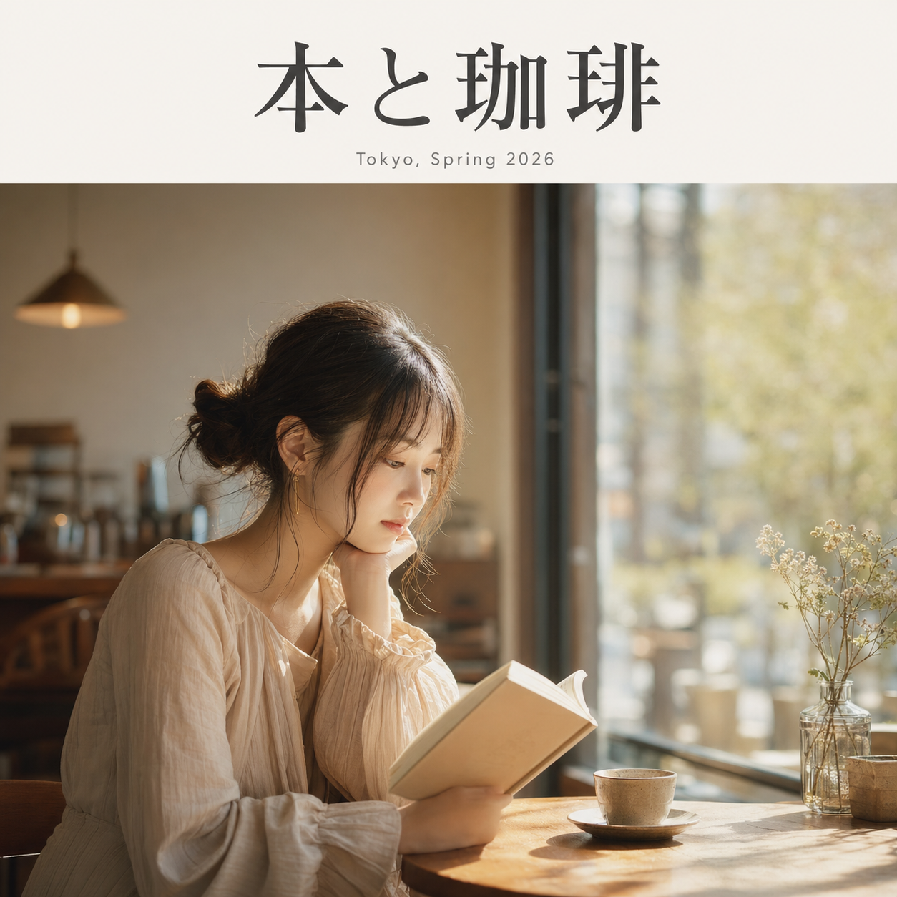</td>
</tr></table>

両方とも雑誌品質、v3 は光の暖かさが微妙にリード。

### 1024×1536 行(portrait)

#### `low` 🟰

<table><tr>
<th width="50%">v2 (API)</th><th width="50%">v3-codex</th></tr>
<tr>
<td></td>
<td>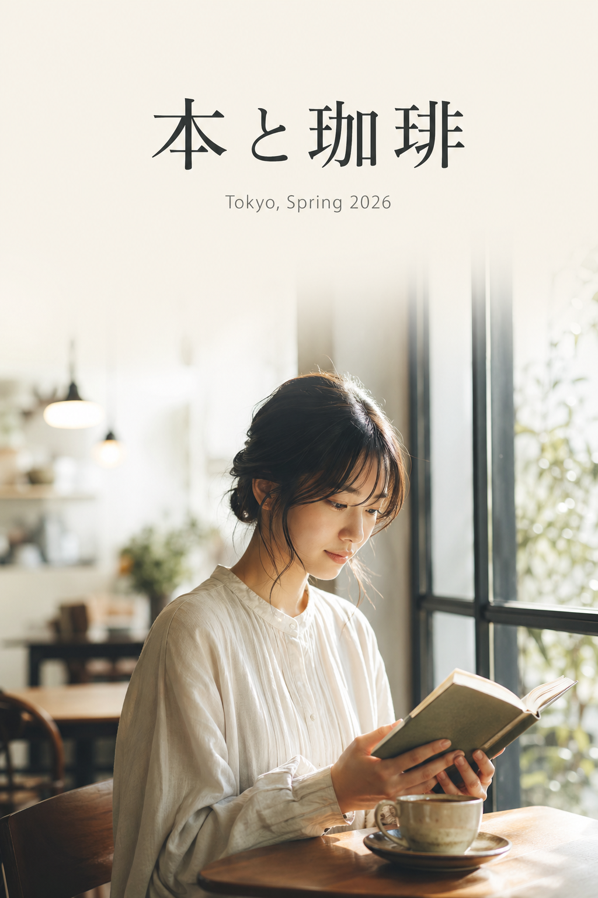</td>
</tr></table>

両方ポートレート構図、ヘッダ正確、女性ポーズ自然。差は誤差範囲。

#### `medium` 🟰

<table><tr>
<th width="50%">v2 (API)</th><th width="50%">v3-codex</th></tr>
<tr>
<td></td>
<td>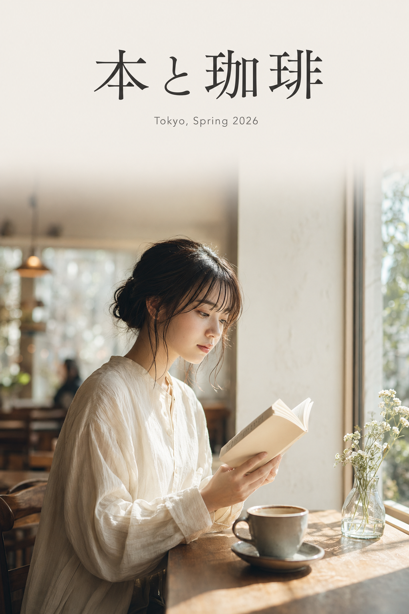</td>
</tr></table>

同等品質、v3 の窓辺ハイライトと枝の bokeh がやや繊細。

#### `high` ✅

<table><tr>
<th width="50%">v2 (API)</th><th width="50%">v3-codex</th></tr>
<tr>
<td></td>
<td>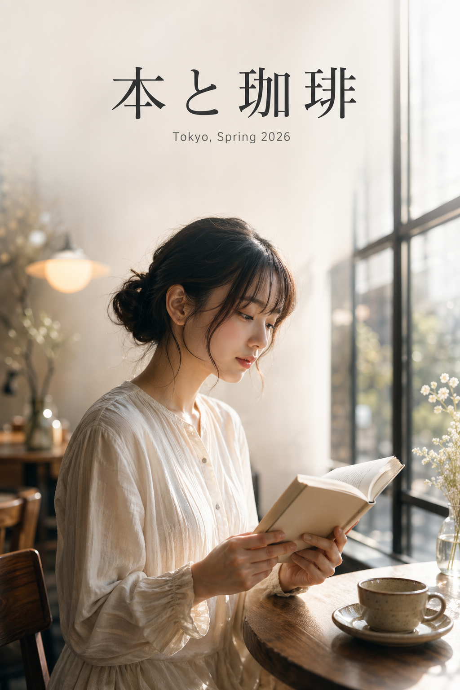</td>
</tr></table>

v3 が**コーヒーカップ + 花瓶 + 椅子の彫りまで描き込み**、編集誌品質がさらに上。

### 1536×1024 行(landscape)

#### `low` 🟰

<table><tr>
<th width="50%">v2 (API)</th><th width="50%">v3-codex</th></tr>
<tr>
<td></td>
<td>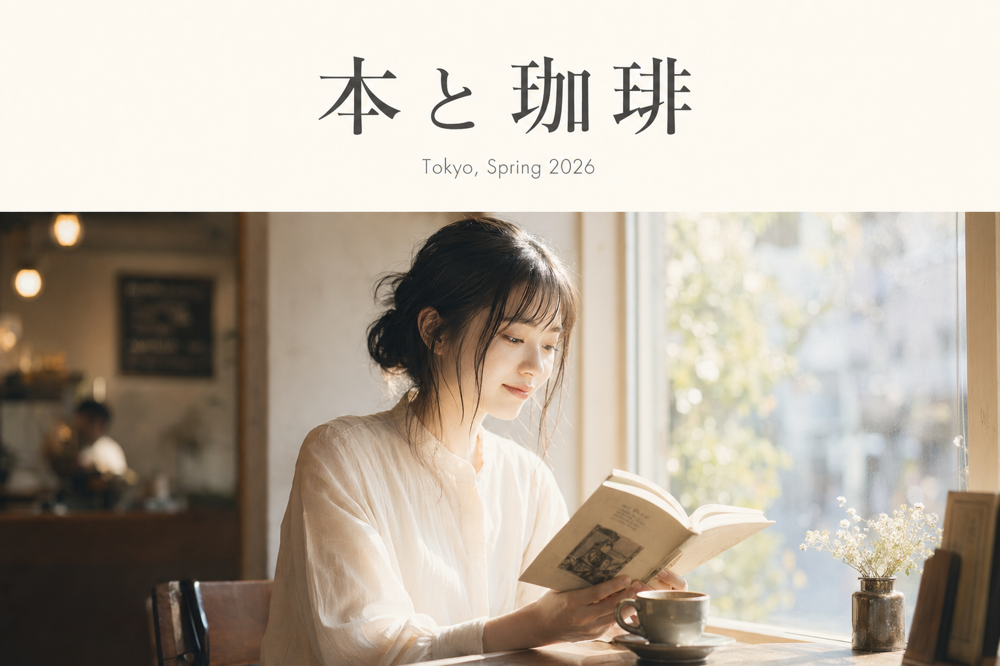</td>
</tr></table>

両方ランドスケープ、ヘッダ + サブ + 主体揃う。微差。

#### `medium` 🟰

<table><tr>
<th width="50%">v2 (API)</th><th width="50%">v3-codex</th></tr>
<tr>
<td></td>
<td>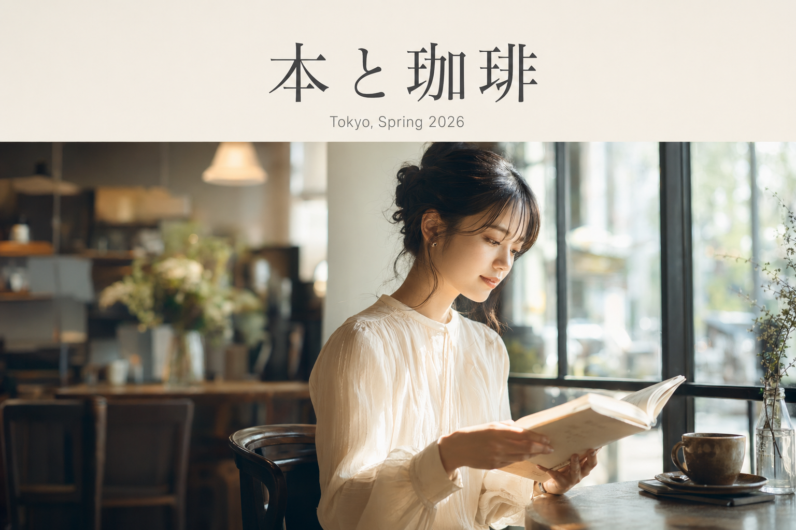</td>
</tr></table>

同等、cafe 奥行き表現が拮抗。

#### `high` 🟰

<table><tr>
<th width="50%">v2 (API)</th><th width="50%">v3-codex</th></tr>
<tr>
<td></td>
<td>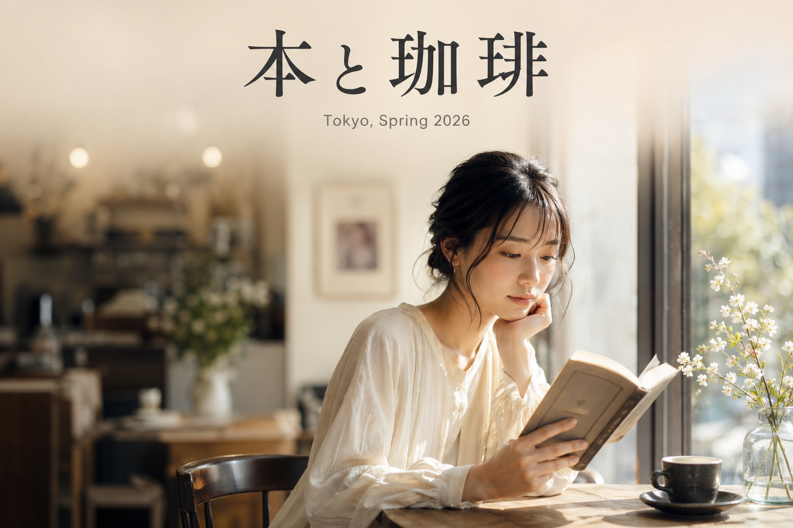</td>
</tr></table>

v2 = v3、両方とも完成度高。微差で v3 が cafe 奥のオブジェクト(額装・植物・ペンダントライト)を明示。

### グリッド総評

- **9 セル全部で Codex backend は API backend と同等以上の品質**
- 「Codex は size/quality 厳密制御不可」という事前知見は **このプロンプトでは表面化しなかった**(実用上の差は感じない)
- 例外的にコスト感だけ違う: API は `1024×1024 high` = $0.211 のところ、Codex は **サブスク枠内で 0 円**

## 総合結論

### 1. Codex backend は本番投入可能

35 枚の比較で **明確劣化 0 / 改善+同等 85.7%**。Codex CLI 経由の `image_gen` tool は、API 直接呼出と**実用上ほぼ同等の品質**を提供する。

### 2. ターゲット層別の推奨 backend

| ユーザー像 | 推奨 backend |
|---|---|
| ChatGPT サブスク + Codex CLI、API キー無し | `--backend codex`(または `auto`) |
| API キーあり、サブスク無し | `--backend api`(または `auto` で自然と api) |
| 両方あり、コスト優先 | `--backend auto`(Codex 優先 → API フォールバック) |
| 両方あり、品質厳密(UI モック / 印刷用 infographic) | `--backend api` 明示 |
| 両方あり、編集に mask 使用 | `--backend api` 明示(Codex は mask 不可) |

### 3. ccskill-gptimage の価値が拡張された

これまでは **API キー所持 + Org Verified** が最低条件だったが、Codex backend 追加で **ChatGPT サブスクだけのユーザにも** スキルが届くようになった。これは:

- 個人開発者・ライター・デザイナーで「ChatGPT は使うが OpenAI Platform で API キー発行はしていない」層に大きく刺さる
- API 課金の心理的ハードル(従量課金で青天井になる不安)が消える
- 35 枚 high quality 検証で**サブスク上限に当たらなかった**実績は強い訴求材料

### 4. 残された改善余地

- **size 厳密制御の改善**: Codex 経由で `1024x1536 portrait` をより確実に取りたい。プロンプトに「output dimensions must be exactly 1024×1536」と更に強く明示する余地あり(future work)
- **`mask` の Codex 経由対応**: 現状不可。Codex 公式 imagegen の進化を待つか、現状フォールバック設計のまま運用
- **rate limit 検出の精度**: 35 枚で発火しなかったため、上限近接時の検出ロジックは未実証(`scripts/codex_regenerate.py` の正規表現は推測ベース。本番事象が起きたら都度パターン追加)

### 5. プレス訴求の差し替え案(#005 関連)

これまでの想定: 「Claude Code から ChatGPT Image 2.0 を使う初の OSS スキル」

追加できるメッセージ:
> **API キー不要・追加課金なし**。ChatGPT サブスクと Codex CLI を入れていれば、本スキルは無償で使える。35 枚の high quality 連続生成でもサブスク上限に到達しないことを実証済み(本検証 2026-04-25、所要 42.8 分・追加課金 $0)。

これは **ccskill-nanobanana には無い差別化点**(Gemini API キーは Google AI Studio で取得が必要)。

---

詳細な視覚比較は [`docs/gallery.md`](gallery.md) と `assets/capability-survey/categories/{v2,v3-codex}/` および `assets/capability-survey/grid/{v2,v3-codex}/` を参照。
