# ccskill-gptimage オプションガイド

## 一覧

| オプション | 効果 | 例 |
|---|---|---|
| `--size` | 出力サイズ — `auto` または厳密な `WxH`(各辺×16・最大辺≤3840・アスペクト≤3:1) | `--size 1024x1536` |
| `--quality` | `low` / `medium` / `high` / `auto` — 描き込み・テキストの精細さ | `--quality high` |
| `--output-format` | `png` / `jpeg` / `webp` | `--output-format webp` |
| `--output-compression` | jpeg/webp の 0–100(大きいほど高品質・大容量) | `--output-compression 80` |
| `--background` | `auto` / `opaque`(透過は `gpt-image-1.5` が必要) | `--background opaque` |
| `--reference` | 参照画像 — 編集モードに切替(複数可) | `--reference base.png` |
| `--mask` | 局所編集用のアルファ PNG マスク(`--reference` 必須) | `--mask mask.png` |
| `--output` | 出力ディレクトリ(無ければ作成) | `--output ./out` |
| `--output-name` | 出力ファイル名の語幹(拡張子は形式から決定) | `--output-name hero` |
| `--model` | モデル ID | `--model gpt-image-1.5` |
| `--moderation` | `auto` / `low` | `--moderation low` |
| `--input-fidelity` | `gpt-image-1.5` 専用(gpt-image-2 は常に最大忠実度) | `--input-fidelity high` |
| `--backend` | `auto` / `codex` / `api` | `--backend api` |

---

## `--size` — 出力サイズ
### 例
```bash
ccskill-gptimage generate "A serene Japanese zen garden with raked gravel, a single red maple tree, soft morning light" \
  --backend api --size 1536x512
```

出力サイズの指定は以下を満たす必要があります。

- 各辺 : 16の倍数
- 最大辺 ≤ 3840 px
- アスペクト比 ≤ 3:1
- 総ピクセル 655,360〜8,294,400

<table>
<tr>
<td colspan="2">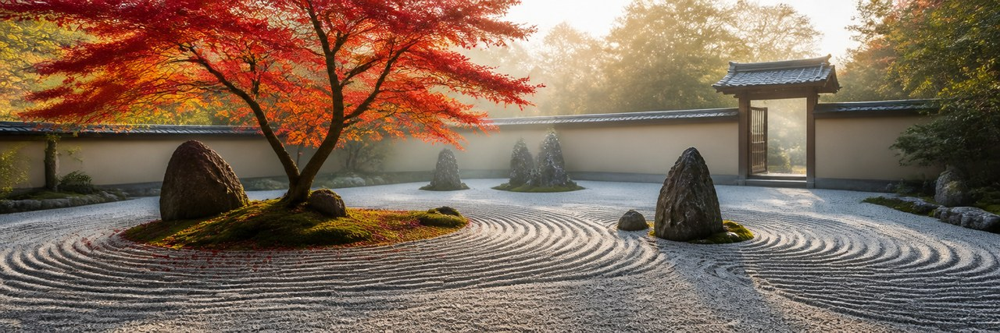<br><code>1536x512</code>
</td>
</tr>
<tr>
<td align="center">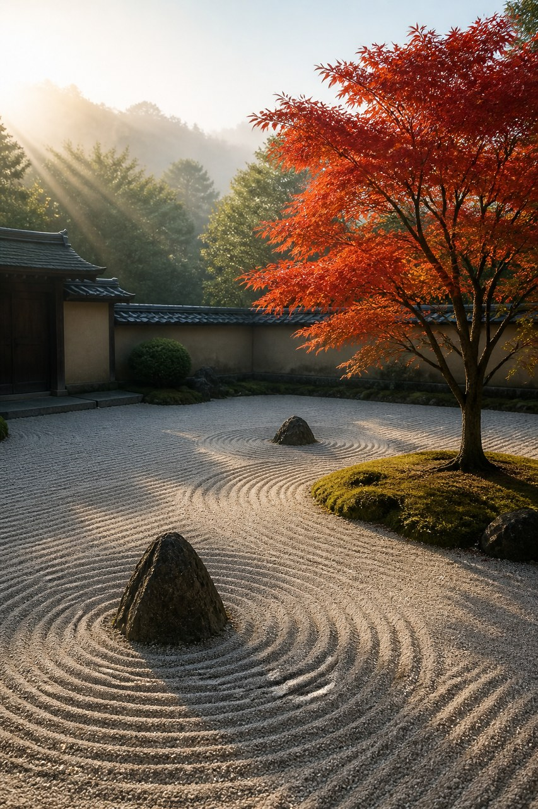<br><code>1024x1536</code></td>
<td align="center">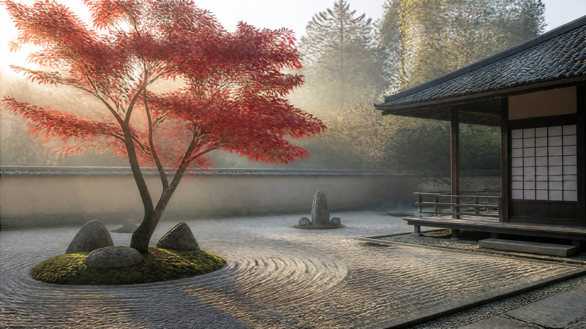<br><code>3840x2160</code>(4K・表示は縮小)</td>
</tr>
</table>

---

## `--quality` — 描き込み・テキストの精細さ
### 例
```bash
ccskill-gptimage generate 'A rustic cafe chalkboard sign, the title "本日のおすすめ" in white chalk at the top, three menu lines below, warm lighting' \
  --backend api --quality high
```

<table>
<tr>
<td align="center">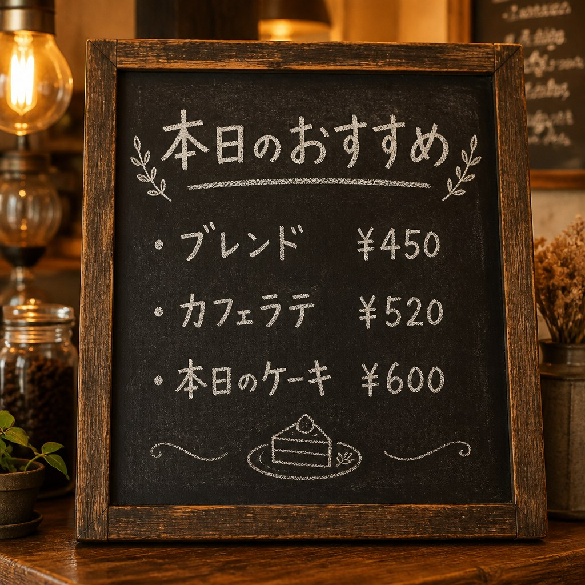<br><code>--quality low</code></td>
<td align="center">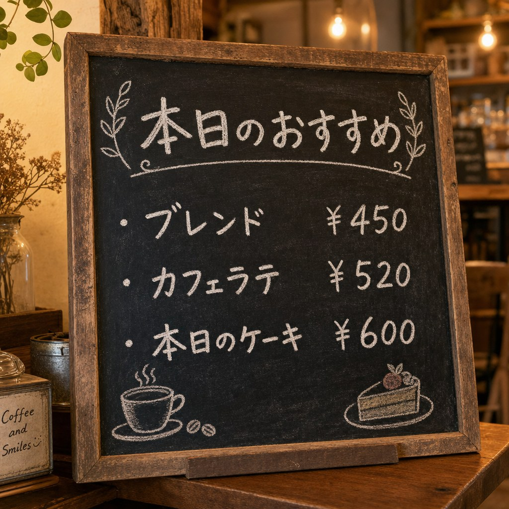<br><code>--quality high</code></td>
</tr>
</table>

---

## `--output-format` / `--output-compression`

ファイル形式を指定。jpeg/webp では品質と容量を調整します。`--output-compression` は値が大きいほど高品質・大容量です。

### 例

```bash
ccskill-gptimage generate "A colorful bowl of fresh fruit salad, top-down view" \
  --backend api --output-format jpeg --output-compression 80
```

| 形式 / 圧縮 | 目安ファイルサイズ(1024×1024) |
|---|---|
| `png` | 約 2.0 MB(可逆) |
| `jpeg` `--output-compression 90` | 約 290 KB |
| `jpeg` `--output-compression 10` | 約 75 KB |
| `webp` `--output-compression 80` | 約 260 KB |

---

## `--background` — 透過
`gpt-image-2` は透過背景に非対応。透過PNGは `--model gpt-image-1.5` を使います。
### 例

```bash
ccskill-gptimage generate "A simple flat vector icon of a red apple, centered, on a transparent background" \
  --backend api --model gpt-image-1.5 --background transparent
```


---

## `--reference` — 既存画像を編集
### 例

```bash
ccskill-gptimage generate "Replace only the background with a sunny green meadow under a blue sky. Keep the red apple exactly as in the reference." \
  --backend api --reference apple.png
```

<table>
<tr>
<td align="center">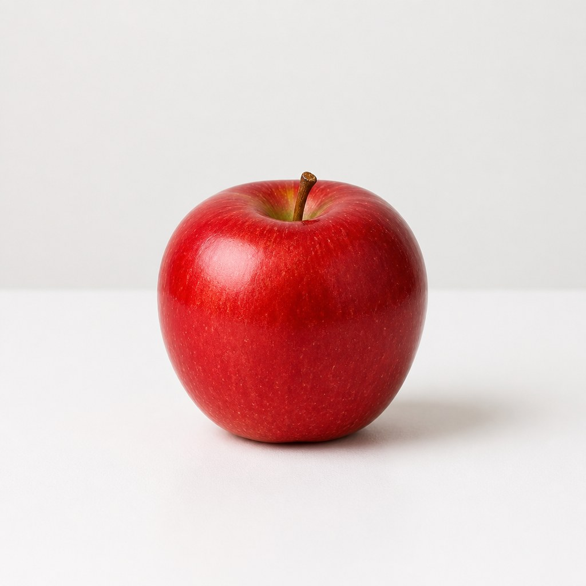<br>参照(元)</td>
<td align="center">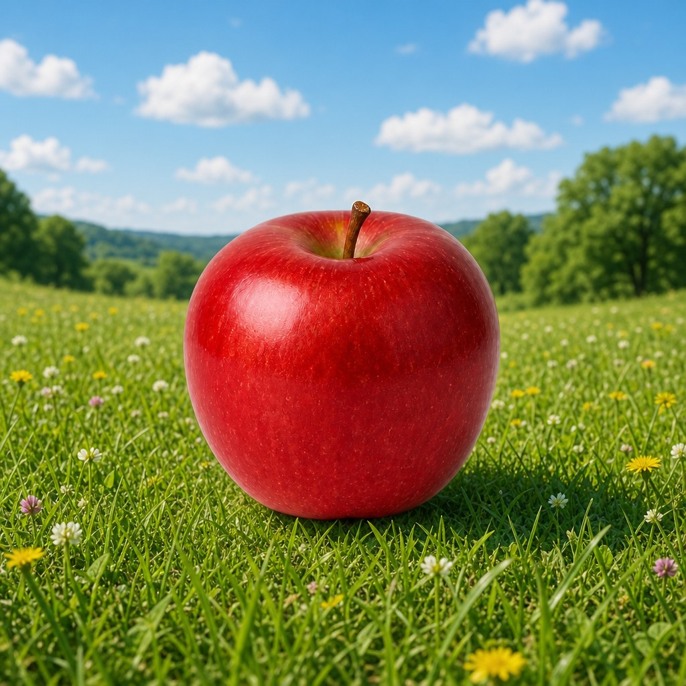<br>結果</td>
</tr>
</table>

---

## `--reference`(複数) — 複数画像の合成
### 例
```bash
ccskill-gptimage generate "Image 1 is a red apple. Image 2 is a Japanese zen garden. Place the apple from Image 1 on the raked gravel of the garden from Image 2, with a soft shadow." \
  --backend api --size 1536x1024 \
  --reference apple.png --reference zen-garden.png
```

<table>
<tr>
<td align="center"><br>Image 1(リンゴ)</td>
<td align="center">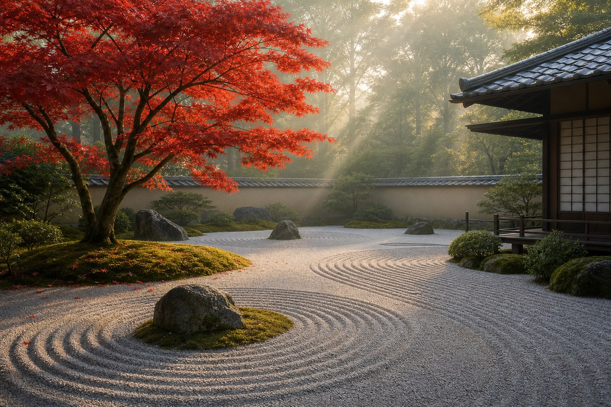<br>Image 2(禅庭)</td>
</tr>
<tr><td colspan="2">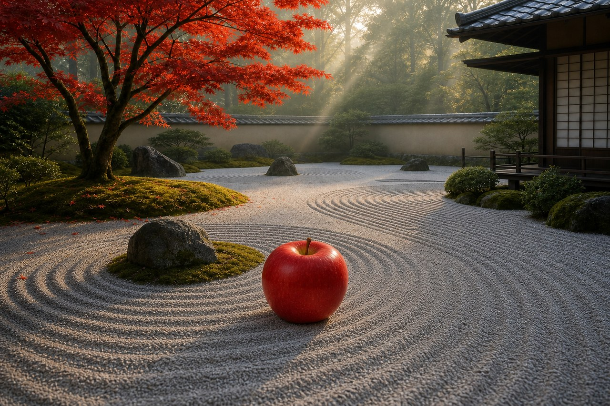<br>合成結果</td></tr>
</table>


---

## `--mask` — 部分編集
透過ピクセル部分のみを編集対象として誘導するマスク画像(PNG形式)を渡します。マスク画像は、別途用意する必要があり、参照画像と同じサイズでなければなりません。

### 例
右上だけをマスクした画像を渡して、リンゴを保ったままその領域に蝶を追加した例。
```bash
ccskill-gptimage generate "Add a small yellow butterfly in the upper-right area. Keep the apple and background exactly the same." \
  --backend api --reference apple.png --mask mask.png
```

<table>
<tr>
<td align="center"><br>参照</td>
<td align="center">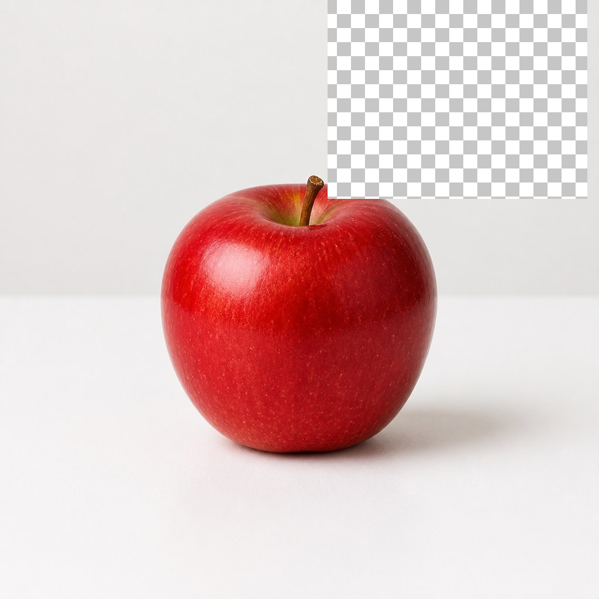<br>マスク — 編集領域</td>
<td align="center">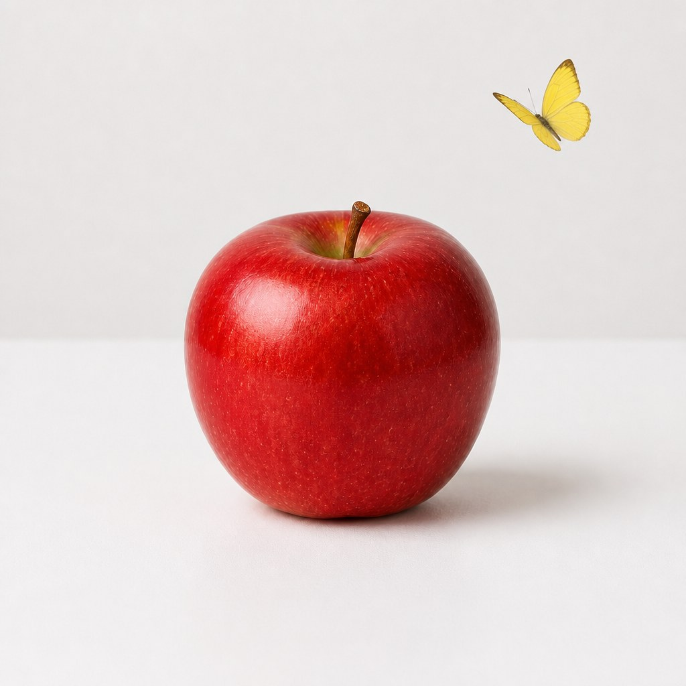<br>結果(蝶を追加)</td>
</tr>
</table>

---

## その他のオプション

| オプション | 補足 |
|---|---|
| `--output` | 出力ディレクトリ。自動作成。既定は `./generated_images`。 |
| `--output-name` | ファイル名の語幹。拡張子は `--output-format` に従う。既定はタイムスタンプ。 |
| `--model` | 既定は `gpt-image-2`。透過背景や `--input-fidelity` には `gpt-image-1.5`。 |
| `--moderation` | `low` でコンテンツフィルタを緩和。既定は `auto`。 |
| `--input-fidelity` | `gpt-image-2` では不要(常に最大忠実度のため自動的に無視)。`gpt-image-1.5` でのみ有効。 |
| `--backend` | `auto` は Codex CLI(API キー不要・ChatGPT サブスク利用)を優先し API へフォールバック。厳密な `--size` や `--mask` は `api` を指定。 |
