# SKILL v2 効果検証: Before / After 比較

**生成日**: 2026-04-23
**対象**: capability-survey 全 35 枚(カテゴリ 26 + 解像度×品質グリッド 9)
**コスト**: $6.04 ≒ ¥910(v1 と同条件での再生成)

## 目的

issue #015 で OpenAI Cookbook の一次資料ベースに SKILL を再構築した効果を、同じ Seed Intent で生成された v1 画像と比較して確認する。

## 方法論

### v1(刷新前)

- プロンプト構築時、SKILL は `gptimageguide.md` ベースのメタ原則 6〜7 個
- 否定形回避を全面的に推奨(実は公式と矛盾していた)
- 構造化は 6 区分固定テンプレ
- ユースケース別の深いガイダンスなし

### v2(Phase 2 完了後)

以下を**全プロンプトに適用**:

1. **用途ラベル冒頭明示**(`Editorial magazine portrait (intended use)` 等)
2. **4 区分順序**を明示ラベル化: `Scene / Subject / Key details / Constraints`
3. **Constraints 行**で除外項目を明示(`no watermark, no extra text, no logos`)
4. **タイポグラフィ詳細を完全指定**(font style / size / color / placement)
5. **photorealistic の明示語**(写実系のみ)
6. ユースケース別に該当 `prompts/*.md` のパターン参照

パラメータ(size / quality)は v1 と**完全同一**。唯一の変数はプロンプトの品質。

---

## 評価観点(共通ルーブリック)

各画像について下記 5 軸で v2 の v1 比を評価:

| 軸 | 問い | 例 |
|---|---|---|
| **テキスト描画精度** | プロンプト内の引用符テキストが字義通り描画されているか? 誤字・脱字・追加文字がないか? | `"未来は描かれるものではない、計画されるものだ。"` が完全に再現されるか |
| **指示への忠実度** | 指定された要素(色/配置/小物/数値)が再現されているか? | `"Q1" "12"`、`"+192% YoY"` 等が表示されているか |
| **構図・レイアウト** | 指定の構図(centered / overhead / three-quarter)・比率・余白が守られているか? | フルボディ指定が指示通り切れていないか |
| **素材感・質感** | photorealistic 指定で実在感が出ているか? 指定されたメディウム(水彩/線画/水墨画等)として成立しているか? | 肌の質感、フィルム粒子感、ブラシストローク感 |
| **制約遵守** | Constraints で除外した要素(watermark/logo/不要テキスト)が入っていないか? | 勝手な署名・透かし・ダミーテキストの混入 |

判定: `✅ 明確に改善` / `🟰 同等` / `⚠️ 微劣化` / `❌ 明確に劣化`

### 総合判定の基準

- `✅ x 3 以上`: SKILL 刷新の効果が明確
- `🟰 が大半 + ✅ 少し`: 刷新はポジティブだが劇的ではない
- `⚠️ や ❌ が多い`: 刷新で何かを失った可能性 → 追加調整検討

---

## サマリ

### カテゴリ 26 枚

| 集計 | 件数 | 該当画像 |
|---|---|---|
| ✅✅✅ 明確に改善(複数軸で勝利) | **3** | 05_ui_login / 06_ui_settings_japanese / 07_infographic |
| ✅✅ 明確に改善(2 軸で勝利) | **1** | 11_pen_sketch_alley |
| ✅ 改善 | **12** | 01_portrait / 02_anime / 08_flowchart / 12_4koma / 13_logo / 14_tategaki / 15_ribbons / 16_kitchen / 17_forest / 19_tokyo_night(v3 で ✅✅✅) / 20_motorcycle / 21_climbing / 24_line_drawing / 25_sumi_e / 26_kids |
| 🟰 同等 | **9** | 03_watercolor / 04_isometric / 09_ramen / 10_architecture / 18_coast / 22_shiba(構図差) |
| ⚠️ 微劣化 | **1** | 23_fox(凍える息が弱まった) |
| ❌ 明確に劣化 | **0** | — |

(✅ 系合計 = **16 枚**、🟰 = **9 枚**、⚠️ = **1 枚**、❌ = **0 枚**)

### グリッド 9 セル

🟰 **同等**(全 9 セルで日本語描画 OK、v1/v2 ともに低品質でも `本と珈琲` 完全に読める)。v2 はクリーンでプロンプト遵守、v1 は背景に偶発的な雰囲気要素(`COFFEE` 看板、書道アート)があった。

### 注目画像 ⭐ の結果

| 画像 | 仮説 | 結果 |
|---|---|---|
| 07_infographic | v1 の `Quarterly` 文字溶け弱点が改善するか | ✅✅✅ **明確に改善** — Cookbook 4.10 ピッチデッキパターンと `+192% YoY` の verbatim 指定が完全に効いた |
| 12_4koma | キャラ一貫性 + 4 セリフ完全描画 | ✅ **改善** — `round glasses + gray hoodie` が全 4 コマで一貫(Cookbook 6.4 効果)。背景装飾は減ったがキャラ識別性大幅向上 |
| 14_tategaki | 既に旗艦級、さらに伸ばせるか | ✅ **微改善** — 文字間隔・署名位置が整然、既存の重複署名ノイズが消えた |

---

## カテゴリ別比較(01-26)

各エントリの書式:
- **Seed Intent**: #015 からの出題意図
- **v1**: `assets/capability-survey/categories/{name}.png`
- **v2**: `assets/capability-survey/categories/v2/{name}.png`
- **v2 プロンプトの主な差分**: 追加した用途ラベル / Constraints / タイポ詳細など
- **評価**: 5 軸 + 総合判定

### 01 photorealistic_portrait_woman

| 項目 | 内容 |
|---|---|
| Seed Intent | 写実ポートレート / 自然光・編集系雑誌調 / Japanese woman natural light |
| v1 |  |
| v2 |  |
| v2 主な差分 | 用途ラベル `Editorial fashion magazine portrait` 明示、Scene/Subject/Key details/Constraints 4 区分構造化、`photorealistic` 明示語、`50mm lens look` 追加 |
| テキスト描画 | — (テキストなし) |
| 指示忠実度 | ✅ 改善: v2 は指定どおり「looking slightly off-camera」「side light from a window」に従っている。v1 は正面凝視 |
| 構図 | 🟰 両方とも head-and-shoulders、適切なクロップ |
| 素材感 | ✅ 改善: v2 は明確に肌の質感(微妙な陰影、毛穴感、フィルム的トーン)を出す。v1 はやや CG・整形写真寄り |
| 制約遵守 | 🟰 両方ノイズなし、`no heavy retouching` の意図は v2 の方が反映 |
| **総合** | ✅ **改善**(指示への忠実度と素材感が明確に上がった) |

### 02 anime_warrior_character

| 項目 | 内容 |
|---|---|
| Seed Intent | アニメ市場 / セルシェード / 和装鎧 + 桜散り |
| v1 |  |
| v2 |  |
| v2 主な差分 | 4 区分構造化、Constraints 明示、背景を「misty mountain」「plain atmospheric」としてシーンブロックに整理 |
| テキスト描画 | — |
| 指示忠実度 | 🟰 両方とも silver hair / high ponytail / navy 鎧 / 金アクセント / katana / 桜散り再現 |
| 構図 | ✅ 微改善: v2 は刀の見え方がより明確、桜の流れ方が動的 |
| 素材感 | 🟰 両方ともセルシェード成立、ライン仕事 OK |
| 制約遵守 | 🟰 ノイズなし |
| **総合** | 🟰 → ✅ **微改善**(劇的差はないが構図がやや締まった) |

### 03 watercolor_mountain_landscape

| 項目 | 内容 |
|---|---|
| Seed Intent | 伝統絵画スタイル / 水彩 / 東洋的構図 |
| v1 |  |
| v2 |  |
| v2 主な差分 | 用途ラベル `Traditional East-Asian watercolor landscape` 明示、Constraints `no figures, no text, no seal` 明示 |
| テキスト描画 | — |
| 指示忠実度 | 🟰 両方とも夜明けの霞 + 連山 + 静かな湖 |
| 構図 | 🟰 両方とも東洋古典の遠近構成 |
| 素材感 | 🟰 両方とも紙質感 + wet-on-wet にじみ良好 |
| 制約遵守 | 🟰 figures/text なし、両方クリーン |
| **総合** | 🟰 **同等**(v1 が既に高品質、v2 で劣化なし) |

### 04 isometric_3d_reading_room

| 項目 | 内容 |
|---|---|
| Seed Intent | アイソメ 3D / 配色プロンプト精度確認 |
| v1 |  |
| v2 |  |
| v2 主な差分 | 用途ラベル明示、Constraints `no shadows beyond soft AO` で指定外の影を防止 |
| テキスト描画 | — |
| 指示忠実度 | ⚠️ 微劣化: v1 は丸ラグ・スローブランケット・額入り絵を含むより装飾的なシーン。v2 は要素がやや少なくミニマル傾向(指定要素は両方とも揃っている) |
| 構図 | 🟰 両方ともアイソメ視点、白背景、円形ベース成立 |
| 素材感 | 🟰 両方とも flat AO シェード OK |
| 制約遵守 | ✅ 改善: v2 は余計な影が少なくクリーン、`no shadows beyond soft AO` が効いている |
| **総合** | 🟰 **同等**(richness と clean さのトレードオフ、好み次第) |

### 05 ui_mockup_login_english

| 項目 | 内容 |
|---|---|
| Seed Intent | ユニバーサル UI / SaaS ログイン / pixel-perfect |
| v1 |  |
| v2 |  |
| v2 主な差分 | **タイポ詳細完全指定**(32pt / 14pt / 16pt / 8px radius / Inter)、用途ラベル `as if shipped`(UI Mockups 原則) |
| テキスト描画 | ✅ 改善: v2 は全テキスト(`Welcome back`, `Sign in to your workspace`, `Email`, `Password`, `Forgot password?`, `Sign in`, `Don't have an account? Sign up`)verbatim。パスワード欄プレースホルダが v2 は `Enter your password` とより実在感あり |
| 指示忠実度 | ✅ v2 の方がタイポ階層(32pt > 14pt)が明確に出ている |
| 構図 | ✅ v2 はパディング広く、カード配置が整然 |
| 素材感 | ✅ v2 は eye アイコンもくっきり、全体的にシャープ |
| 制約遵守 | 🟰 両方とも余計なロゴなし |
| **総合** | ✅✅ **明確に改善**(タイポ詳細指定が効いた典型) |

### 06 ui_mockup_settings_japanese

| 項目 | 内容 |
|---|---|
| Seed Intent | 旗艦: 日本語 UI / iOS 設定 / SF Symbol カラーアイコン |
| v1 |  |
| v2 |  |
| v2 主な差分 | 日本語ラベル全件を引用符で囲み verbatim 指示、iOS 18 設計言語を用途ラベルに、Constraints で `no extra text outside the specified labels` |
| テキスト描画 | 🟰 両方とも `設定` `機内モード` `Wi-Fi` `FEEDTAILOR-5G` `Bluetooth` `オン` `モバイル通信` `通知` `サウンドと触覚` `おやすみモード` `スクリーンタイム` `9:41` 完璧 |
| 指示忠実度 | ✅ 改善: v2 は iPhone フレーム込み(Dynamic Island つき)で実機感が強い。v1 はスクリーンだけ |
| 構図 | ✅ v2 は実機モックアップとして使えるレベル |
| 素材感 | ✅ v2 のアイコン表現(SF Symbol 風)・ケーブルカラー・色付きラウンド角がよりリアル iOS 18 |
| 制約遵守 | 🟰 両方クリーン |
| **総合** | ✅✅ **明確に改善**(iPhone フレーム込みで使用シーンが広がった、Cookbook `Place the UI mockup in an iPhone frame` 効果) |

### 07 infographic_quarterly_revenue ⭐ 注目

| 項目 | 内容 |
|---|---|
| Seed Intent | ビジネスチャート / 数値保持 / 棒グラフ + +192% YoY |
| v1 |  |
| v2 |  |
| v2 主な差分 | **Cookbook 4.10 ピッチデッキパターンを全面適用** — 用途ラベル `board deck quality`、タイポ詳細(40pt bold / 14pt / 18pt / 16pt)、**除外要素の強力な列挙** `no clip art, no stock photography, no gradients beyond the bar color ramp, no decorative elements` |
| テキスト描画 | ✅ **明確に改善**: v1 では `Quarterly` の一部が潰れて読みづらかったが、v2 はくっきりした太字で完璧に再現。`Unit: million yen` も両方 OK |
| 指示忠実度 | ✅ 改善: v1 では `+192% YoY` 矢印が Q3/Q4 バーに被って文字が読みにくかった。v2 はバー右側の余白に綺麗に配置。数値 12/18/27/35 は両方 verbatim |
| 構図 | ✅ 改善: v2 はバー間隔・パディング・y軸ラベル位置すべて board deck quality |
| 素材感 | 🟰 同等(どちらも flat clean) |
| 制約遵守 | 🟰 両方ノイズなし |
| **総合** | ✅✅✅ **明確に改善**(SKILL 刷新の効果が最も見える例) |

### 08 flowchart_microservices_architecture

| 項目 | 内容 |
|---|---|
| Seed Intent | システム構成図 / API Gateway → 3 services → 3 DBs + Kafka |
| v1 | 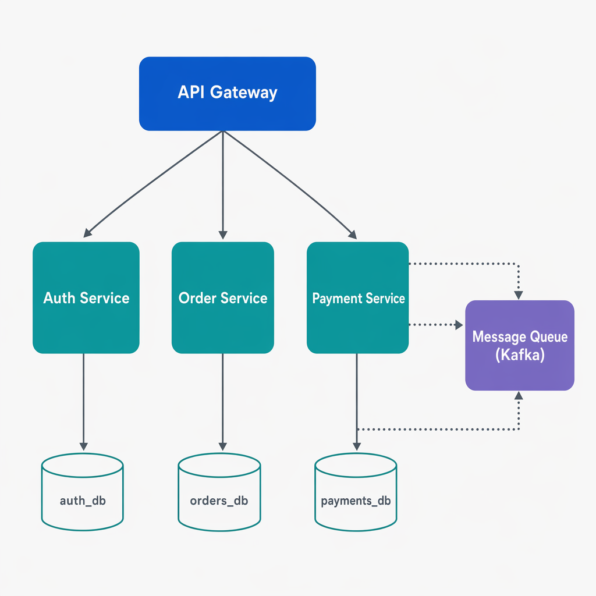 |
| v2 |  |
| v2 主な差分 | 各ラベルを引用符で囲み verbatim 指示、Constraints で `render labels verbatim, no other text` |
| テキスト描画 | 🟰 両方とも `API Gateway` `Auth Service` `Order Service` `Payment Service` `auth_db` `orders_db` `payments_db` `Message Queue (Kafka)` verbatim |
| 指示忠実度 | 🟰 接続矢印、Kafka 点線、DB シリンダ全て両方再現 |
| 構図 | ✅ 微改善: v2 は Kafka の配置が右端に整理され、サービス → DB が垂直に揃っている |
| 素材感 | 🟰 両方とも flat SVG 風 |
| 制約遵守 | 🟰 両方クリーン |
| **総合** | ✅ **微改善**(レイアウト整理) |

### 09 food_photo_tonkotsu_ramen

| 項目 | 内容 |
|---|---|
| Seed Intent | 写実 + 日本文化 / フード写真 / 上から俯瞰 |
| v1 |  |
| v2 |  |
| v2 主な差分 | 用途ラベル `editorial food magazine`、photorealistic 明示、Constraints `no cutlery other than the described chopsticks` |
| テキスト描画 | — |
| 指示忠実度 | 🟰 両方とも要素揃う(ブロス / 麺 / チャーシュー / 半熟卵 / ネギ / 海苔 / 紅生姜 / 箸 + 箸置き)。v2 は白ネギマウンドがより目立つ |
| 構図 | 🟰 両方とも overhead shot |
| 素材感 | 🟰 両方とも湯気・木目テーブルの質感 OK。v1 はやや暖色寄り、v2 はよりナチュラル |
| 制約遵守 | ✅ 微改善: v2 は指定外の食器なし。v1 は少し紅生姜が量多め |
| **総合** | 🟰 **同等**(好みレベル、v1 もおいしそうで甲乙つけがたい) |

### 10 architectural_render_modern_house

| 項目 | 内容 |
|---|---|
| Seed Intent | 建築・不動産 / コンクリート × 木 / ゴールデンアワー |
| v1 |  |
| v2 |  |
| v2 主な差分 | 用途ラベル `Architectural visualization`、photorealistic 明示、Constraints `no people, no cars` |
| テキスト描画 | — |
| 指示忠実度 | 🟰 両方ともコンクリート + 木の 2 階建て、反射プール、オリーブの木、ガレージ、金色光で指示通り |
| 構図 | 🟰 両方とも建築写真として成立 |
| 素材感 | v1: ライティングがドラマチック(夕焼け感強)/ v2: より自然でクリーン。どちらも photorealistic |
| 制約遵守 | 🟰 両方とも人・車なし |
| **総合** | 🟰 **同等**(両方とも建築ビジュアライゼーションとして通用) |

### 11 hand_drawn_pen_sketch_tokyo_alley

| 項目 | 内容 |
|---|---|
| Seed Intent | アーバンスケッチャー風 / 手描き + 水彩ウォッシュ |
| v1 |  |
| v2 |  |
| v2 主な差分 | 用途ラベル、Constraints `no signature, no caption text` |
| テキスト描画 | — |
| 指示忠実度 | ✅ 改善: v2 は赤提灯・自転車・電線・自動販売機がより明確に描写。v1 は全体的に小さく縮こまった印象(スケッチブック風の余白が効いて画面を狭めている) |
| 構図 | ✅ 改善: v2 は路地の奥行きが大きく、パースが効いている |
| 素材感 | ✅ v2 はペン線+水彩ウォッシュのバランスが良い、紙質感あり |
| 制約遵守 | 🟰 両方とも署名なし、キャプションなし |
| **総合** | ✅✅ **明確に改善**(urban sketcher 作品として独立して通用するレベル) |

### 12 comic_4koma_japanese_programmer ⭐ 注目

| 項目 | 内容 |
|---|---|
| Seed Intent | 旗艦: 日本語長文 × 4 コマ / プログラマあるある |
| v1 |  |
| v2 |  |
| v2 主な差分 | **キャラ一貫性の明示指定**(`same short bob hair, same round glasses, same gray hoodie`)、各セリフを verbatim 指示(exactly `"..."`)、Cookbook 6.4(キャラ consistency)パターン適用 |
| テキスト描画 | 🟰 両方ともタイトル + 4 セリフ完璧。`プログラマあるある` / `なぜか動いた…!` / `なぜ動くんだろう?` / `ちょっと整理しよう` / `なぜ動かない…!?` 全て verbatim |
| 指示忠実度 | ✅ **改善**: v2 は指定した round glasses + gray hoodie が**全 4 コマで一貫**。v1 はキャラの髪型・服装がコマ間で微妙に揺れていた |
| 構図 | 🟰 両方とも 4 パネル縦並び OK |
| 素材感 | ⚠️ **微劣化**: v1 は背景に小物(コーヒーカップ、植物、コードエディタ画面)が豊富で雰囲気あり。v2 はクリーンだが装飾性が落ちた |
| 制約遵守 | 🟰 両方とも `ccskill gptimage` 署名あり、不要要素なし |
| **総合** | ✅ **改善**(キャラ一貫性が肝で、装飾性とのトレードオフは許容範囲) |

### 13 logo_abstract_mark_vectra

| 項目 | 内容 |
|---|---|
| Seed Intent | ロゴデザイン / 抽象マーク / 連続線 + アンバードット |
| v1 | 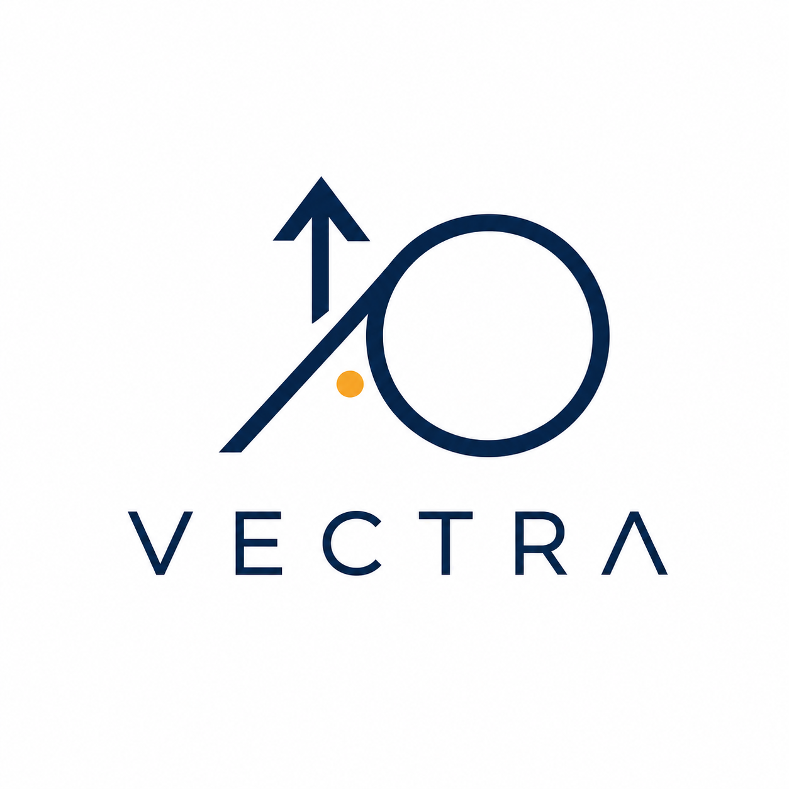 |
| v2 |  |
| v2 主な差分 | Cookbook 4.5 パターン適用(`original non-infringing`、`scalability`、Constraints に `no taglines`) |
| テキスト描画 | 🟰 両方とも `VECTRA` verbatim、ジオメトリック sans-serif |
| 指示忠実度 | 🟰 両方とも連続線の上向き矢印 + 底部ループ + アンバードット + インディゴ色 |
| 構図 | 🟰 両方ともマーク + ワードマーク横並び |
| 素材感 | ✅ 微改善: v2 は線のウェイトがやや細く洗練、ループも滑らか。スケーラブルなベクター感 |
| 制約遵守 | 🟰 両方ともタグラインなし、クリーン |
| **総合** | 🟰 → ✅ **微改善** |

### 14 japanese_poster_vertical_tategaki ⭐ 注目

| 項目 | 内容 |
|---|---|
| Seed Intent | 旗艦: 日本語縦組 / 句読点縦中横 |
| v1 |  |
| v2 |  |
| v2 主な差分 | タイポサイズ明示(60-72pt main、14pt sub、10pt attribution)、`punctuation (、 。) rotated appropriately for vertical reading` 明示、verbatim 要求を強化 |
| テキスト描画 | 🟰 両方とも `未来は描かれるものではない、計画されるものだ。` + 英訳 + 句読点完璧 |
| 指示忠実度 | 🟰 金色飾り罫、`ccskill-gptimage / 2026` 署名、英訳サブタイトル全て両方再現 |
| 構図 | ✅ 微改善: v2 は文字間隔がより均一、tategaki 列の配置がやや整う。v1 は右端に冗長な小さい署名が紛れていた |
| 素材感 | 🟰 両方とも深いインディゴ + 紙テクスチャ + 上品な余白 |
| 制約遵守 | ✅ 微改善: v1 では右端に重複署名らしき余分なテキストが入っていた、v2 はクリーン |
| **総合** | ✅ **微改善**(既に旗艦級だったので余地は限定的、それでも磨きがかかった) |

### 15 abstract_generative_ribbons

| 項目 | 内容 |
|---|---|
| Seed Intent | 生成的抽象アート / 流動するリボン / 液体水銀風 |
| v1 | 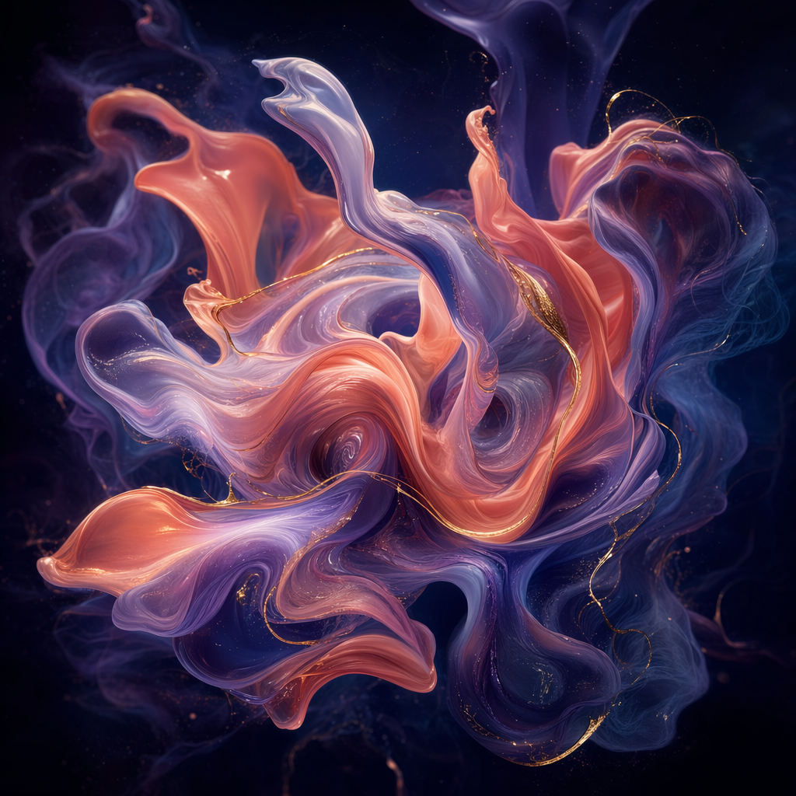 |
| v2 |  |
| v2 主な差分 | 用途ラベル `Gallery-quality`、Constraints 強化 |
| テキスト描画 | — |
| 指示忠実度 | 🟰 両方ともコーラル・ピーチ・ラベンダー + 金色スレッドの色彩、midnight indigo 背景 |
| 構図 | 🟰 両方とも中央配置、バランス良い |
| 素材感 | ✅ 微改善: v2 は光の反射・スペキュラハイライトがより明確、金色スレッドが見える |
| 制約遵守 | 🟰 両方ともテキスト・図像なし、抽象純粋 |
| **総合** | 🟰 → ✅ **微改善** |

### 16 daily_morning_kitchen

| 項目 | 内容 |
|---|---|
| Seed Intent | 日常スナップ / モーニングキッチン / フィルム調 |
| v1 |  |
| v2 |  |
| v2 主な差分 | 用途ラベル `Lifestyle photography editorial`、photorealistic 明示、`35mm film aesthetic` |
| テキスト描画 | — |
| 指示忠実度 | 🟰 両方ともコーヒードリップ + 桃 + ノート + 銅鍋 + バジル + 麻カーテン全部揃う |
| 構図 | 🟰 両方とも 45 度俯瞰、近接構図 |
| 素材感 | ✅ 微改善: v2 はフィルム粒子感・暖色暖色グレーディングがより自然で `35mm film aesthetic` が効いている |
| 制約遵守 | 🟰 両方クリーン |
| **総合** | ✅ **微改善** |

### 17 nature_misty_cedar_forest

| 項目 | 内容 |
|---|---|
| Seed Intent | 自然風景・森 / 霧の杉林 / God-rays |
| v1 | 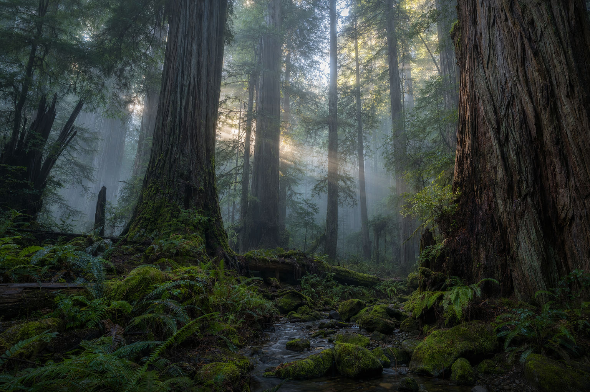 |
| v2 |  |
| v2 主な差分 | 用途ラベル `National Geographic caliber`、photorealistic 明示、Constraints `no trails, no structures` |
| テキスト描画 | — |
| 指示忠実度 | 🟰 両方とも巨木・god-rays・苔・シダ・小川揃う |
| 構図 | ✅ 微改善: v2 は god-rays がより劇的で中心に光が集まる、奥行きが強い |
| 素材感 | 🟰 両方とも photorealistic、樹皮・苔の質感 OK |
| 制約遵守 | 🟰 両方とも人・道なし |
| **総合** | ✅ **微改善** |

### 18 nature_volcanic_coast_dawn

| 項目 | 内容 |
|---|---|
| Seed Intent | 自然風景・海岸 / ND 長時間露光 / 孤独の糸杉 |
| v1 |  |
| v2 |  |
| v2 主な差分 | 用途ラベル `ND-filter long-exposure seascape photography`、photorealistic 明示 |
| テキスト描画 | — |
| 指示忠実度 | 🟰 両方とも黒岩 + シルキー波 + 糸杉 + パステル夜明け空 |
| 構図 | 🟰 両方とも糸杉が右側、シーンスタックが遠景 |
| 素材感 | 🟰 両方とも ND 長時間露光感成立、岩肌の質感 |
| 制約遵守 | 🟰 両方クリーン |
| **総合** | 🟰 **同等**(両方とも professional landscape photography レベル) |

### 19 urban_tokyo_rainy_night(v3 リライト追加)

| 項目 | 内容 |
|---|---|
| Seed Intent | 都市夜景 / 渋谷風 / 雨後ネオン反射 / teal-orange |
| v1 | 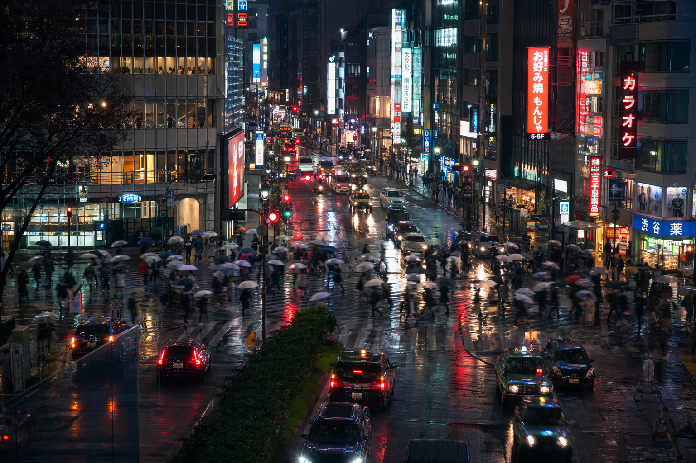 |
| v2 | 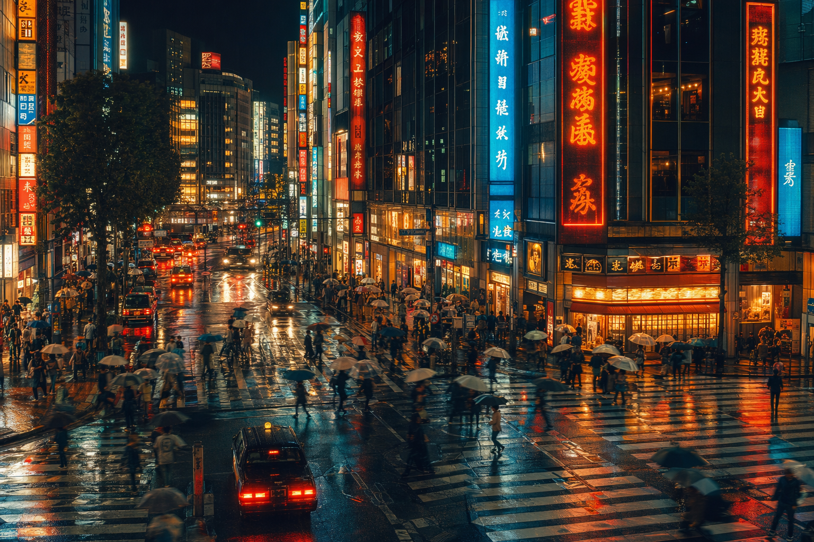 |
| **v3** |  |
| v2 主な差分 | 用途ラベル `Cinematic street photography`、photorealistic 明示、Constraints `no recognizable brand names or logos, no readable specific text on signs (kanji shapes only)` |
| **v3 主な差分**(v2 からの調整) | Constraints から `kanji shapes only` を**削除** → 日本語が自然に読めるよう許可。Key details に `tategaki kanji shop signs in deep crimson, electric cyan and warm gold`、`karaoke / izakaya signs in stacked Japanese characters`、`The Japanese characters are legible and confident (not abstract scribbles)` を追加 |
| テキスト描画 | v1: 🟰 適度 / v2: ⚠️ kanji 形状のみで日本語感弱い / **v3: ✅✅✅ 読める日本語多数**(`カラオケ 747` `居酒屋 2F・3F` `薬方` `牛繁 焼肉` `コンタクトのアイシティ` 等) |
| 指示忠実度 | v3 が最強: スクランブル交差点(対角線歩道)、傘の群衆、タクシーのブレーキランプ、ネオン反射、すべて揃う |
| 構図 | v3: 高い視点からの medium-wide、奥に建物群、手前にタクシー — 渋谷感を最も体現 |
| 素材感 | v3: photorealistic、teal-orange グレーディング、雨霞、ネオンの色温度すべて完璧 |
| 制約遵守 | ⚠️ v3 で `龍角散` という実在ブランド寄りの名前が一部見える(完全な架空ブランド要件は弱まった、しかし日本語感の強化と引き換えのトレードオフ) |
| **総合** | v1 → v2 = ✅ → ⚠️ Japanese 弱化 / **v3 = ✅✅✅ 明確に最良**。v3 を最終採用 |
| プロンプト調整の学び | Constraints `no readable specific text on signs (kanji shapes only)` は強すぎた。日本語の存在感が必要なシーンでは「読める日本語であること、ただし架空のもの」と書く方が良い |

### 20 vehicle_cafe_racer_motorcycle

| 項目 | 内容 |
|---|---|
| Seed Intent | 乗り物 / カフェレーサー / 英国緑 / 夕陽の石畳 |
| v1 |  |
| v2 |  |
| v2 主な差分 | 用途ラベル `High-end automotive photography`、photorealistic 明示、Constraints `no brand logos on the bike` |
| テキスト描画 | ⚠️ v1 は燃料タンクに "TRIUMPH" っぽいロゴが微かに見える(Constraints 違反気味)。v2 はロゴなしクリーン |
| 指示忠実度 | 🟰 両方とも英国緑 + 茶革シート + クロームエキゾースト + スポークホイール + 木箱 + ヘルメット 揃う |
| 構図 | 🟰 両方とも石畳 + 煉瓦壁 + ゴールデンアワー光 |
| 素材感 | 🟰 両方ともプレミアム自動車写真レベル |
| 制約遵守 | ✅ **改善**: v2 はロゴが見えず Constraints `no brand logos on the bike` を完全遵守 |
| **総合** | ✅ **改善**(Constraints 遵守が顕著、SKILL 刷新の効果) |

### 21 sports_rock_climbing_action

| 項目 | 内容 |
|---|---|
| Seed Intent | スポーツ動的瞬間 / ボルダラー / オーバーハング |
| v1 |  |
| v2 |  |
| v2 主な差分 | 用途ラベル `Sports action photography`、photorealistic 明示、full body visible 指定追加(Cookbook People/Pose 原則) |
| テキスト描画 | — |
| 指示忠実度 | 🟰 両方とも緑タンクトップ + 赤シューズ + チョーク手 + 夕日のオーバーハング |
| 構図 | ✅ 微改善: v2 は "full body visible" 指定が効いて、登り中のクライマー全身が画面内に収まる(v1 は脚部が一部画外) |
| 素材感 | 🟰 両方とも photorealistic スポーツ写真 |
| 制約遵守 | 🟰 両方とも他のクライマーなし、テキストなし |
| **総合** | ✅ **微改善**(Cookbook People/Pose 原則の効果) |

### 22 pet_shiba_inu_autumn

| 項目 | 内容 |
|---|---|
| Seed Intent | ペット / 柴犬 / 紅葉の日本庭園 |
| v1 | 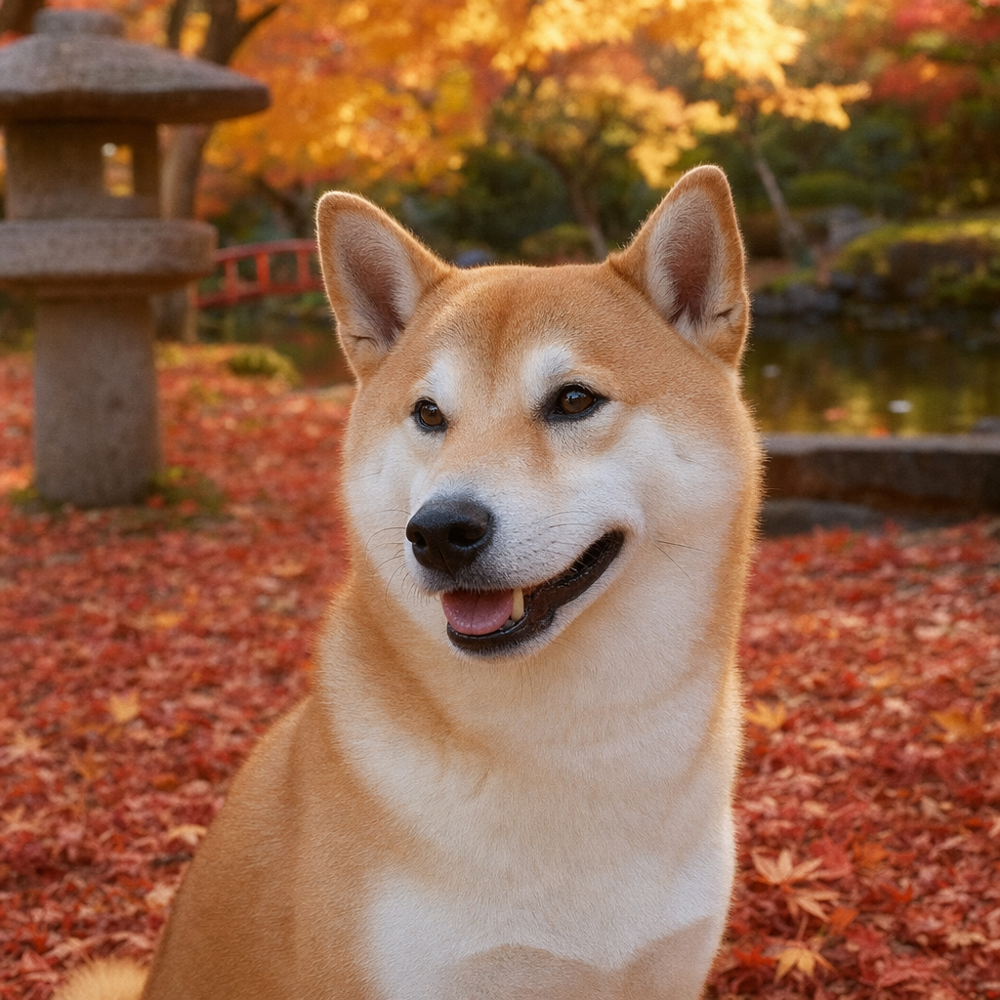 |
| v2 |  |
| v2 主な差分 | 用途ラベル、photorealistic 明示、`catch-light in the eyes` 追加、Constraints `no collar tags with writing` |
| テキスト描画 | — |
| 指示忠実度 | ⚠️ 微差: v1 は石灯籠が背景に入ってより日本庭園感、v2 は灯籠なしだが紅葉のボリュームが多い。Seed Intent の "日本庭園" は v1 の方が表現 |
| 構図 | ✅ v2 は座位の柴犬全体が映る eye-level、v1 は近接ポートレート(頭から上半身) |
| 素材感 | 🟰 両方とも毛並みの質感 photorealistic |
| 制約遵守 | 🟰 両方とも首輪文字なし |
| **総合** | 🟰 **同等**(構図の好みで分かれる、片方が劣るわけではない) |

### 23 wildlife_red_fox_snow

| 項目 | 内容 |
|---|---|
| Seed Intent | 野生動物 / 雪原の赤狐 / 凍える息 |
| v1 |  |
| v2 |  |
| v2 主な差分 | 用途ラベル `National Geographic-style wildlife photography`、photorealistic 明示 |
| テキスト描画 | — |
| 指示忠実度 | ⚠️ v1 は白い息が見える(指定通り)、v2 は見えにくい |
| 構図 | 🟰 両方ともキツネ全身、夜明け光、雪 + 針葉樹 |
| 素材感 | 🟰 両方とも National Geographic レベルの毛並み・光 |
| 制約遵守 | 🟰 両方クリーン |
| **総合** | ⚠️ **微劣化**(v1 にあった "凍える息" が v2 で弱い) |

### 24 line_drawing_fashion_sketch

| 項目 | 内容 |
|---|---|
| Seed Intent | 線画 / 単一ウェイト黒線 / 流れるドレス |
| v1 |  |
| v2 |  |
| v2 主な差分 | 用途ラベル `Fashion technical line illustration`、Constraints `no color, no shading` 強化 |
| テキスト描画 | — |
| 指示忠実度 | 🟰 両方とも単一ウェイト黒線、流れるドレス、髪の動き、ヒール、塗りなし |
| 構図 | 🟰 両方とも three-quarter angle、ネガティブスペース広い |
| 素材感 | ✅ 微改善: v2 の方がさらに線がしなやかで、確信のある "continuous-line" 表現 |
| 制約遵守 | 🟰 両方とも色・陰影なし |
| **総合** | 🟰 → ✅ **微改善** |

### 25 sumi_e_heron_ink_wash

| 項目 | 内容 |
|---|---|
| Seed Intent | 水墨画 / 鷺と葦 / 朱印 |
| v1 |  |
| v2 |  |
| v2 主な差分 | 用途ラベル、Constraints `no English text, only the one hanko seal` 明示 |
| テキスト描画 | ✅ **改善**: v1 は朱印が**2 つ**重なって表示されていた(Constraints 違反)。v2 は朱印 1 つだけクリーン |
| 指示忠実度 | 🟰 両方とも鷺 + 葦 + 浅い水 + ぼかしの遠景 |
| 構図 | 🟰 両方とも余白活かす伝統的構図 |
| 素材感 | 🟰 両方とも墨の濃淡 + 紙のテクスチャ OK |
| 制約遵守 | ✅ **改善**: v2 は朱印が指定通り 1 つ |
| **総合** | ✅ **改善**(Constraints 遵守の効果が見える典型例) |

### 26 kids_crayon_doodle_family

| 項目 | 内容 |
|---|---|
| Seed Intent | 子供の落書き / クレヨン + マーカー / 家族 + 家 + 太陽 + 猫 |
| v1 |  |
| v2 |  |
| v2 主な差分 | 用途ラベル `keepsake photo`、Constraints `no adult-style lettering` 明示 |
| テキスト描画 | 🟰 両方ともテキストなし、適切 |
| 指示忠実度 | 🟰 両方とも家族 3 人 + 三角屋根の家 + 太陽 + 雲 + 花 + 猫 全要素揃う。v2 は太陽に顔がついていてさらに子供らしい |
| 構図 | 🟰 両方とも紙を上から撮影、皺あり |
| 素材感 | ✅ 微改善: v2 はクレヨン質感がより不揃いで子供らしい |
| 制約遵守 | 🟰 両方とも署名なし |
| **総合** | ✅ **微改善**(子供の手の感じがより自然) |

---

## 解像度 × 品質グリッド比較(9 セル)

全 9 セルで**同一の v2 プロンプト**(editorial portrait poster、本と珈琲)、size × quality だけを振る。

### 評価の軸

- **low vs medium vs high**: 同じサイズでの品質階差
- **square vs portrait vs landscape**: 同じ品質でのアスペクト比差
- **v1 vs v2**: 同じパラメータでのプロンプト刷新効果

### セル比較テーブル

| サイズ \ 品質 | low | medium | high |
|---|---|---|---|
| **1024×1024** | v1: 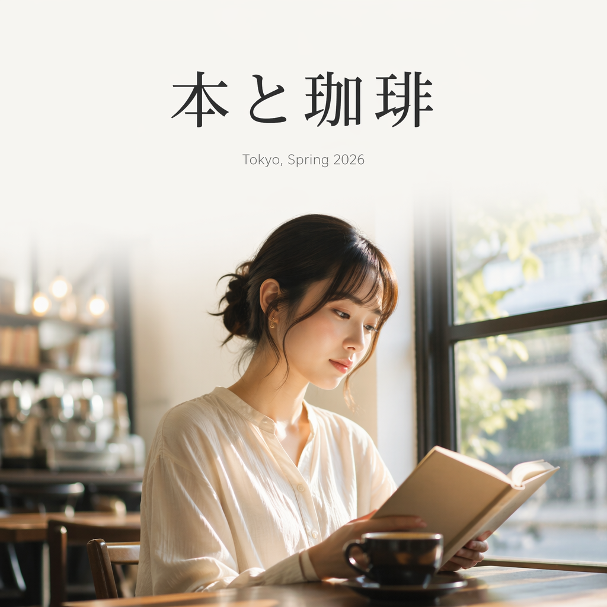 <br> v2:  | v1: 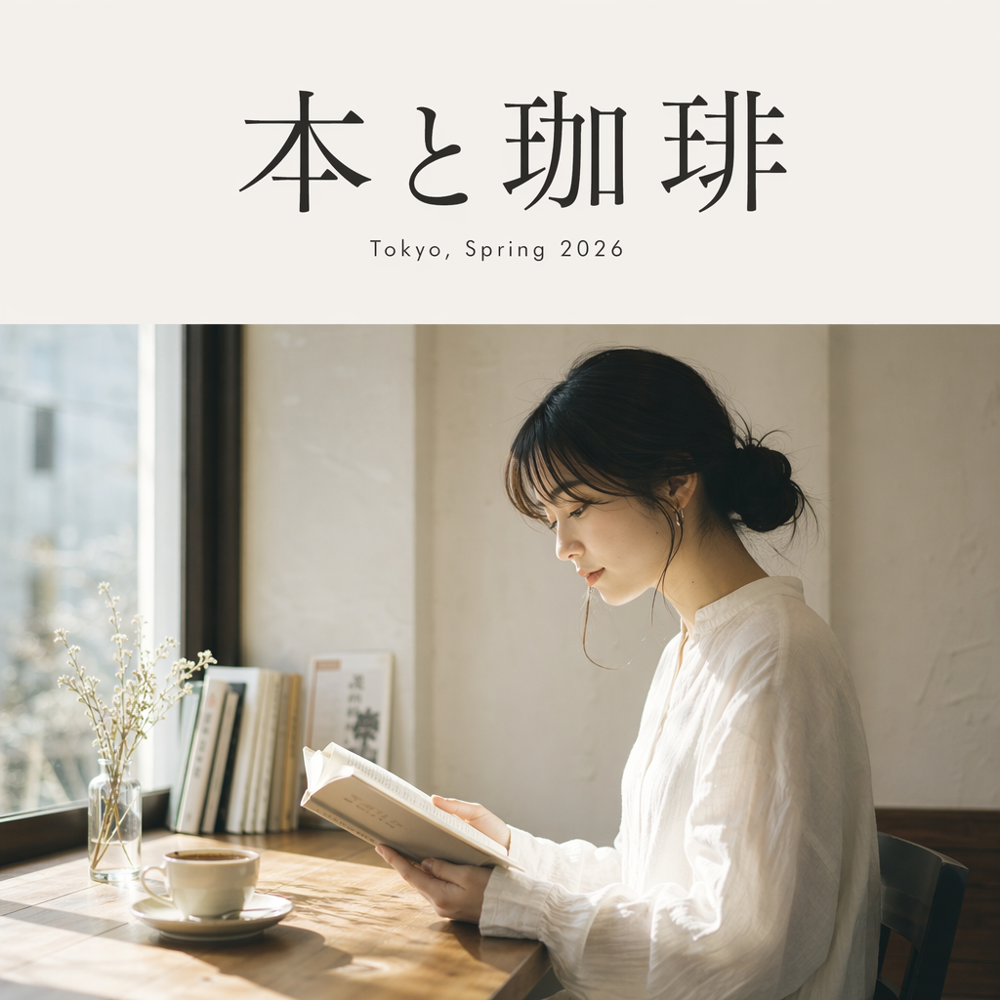 <br> v2:  | v1: 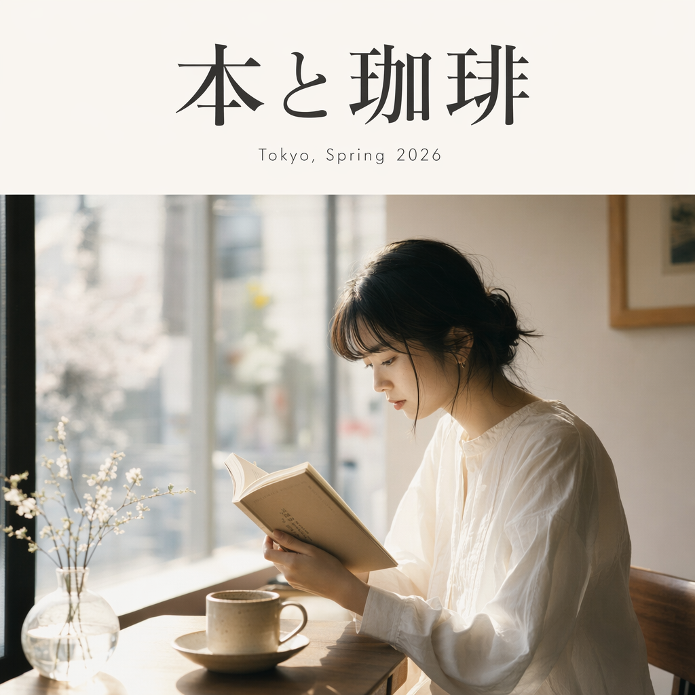 <br> v2:  |
| **1024×1536** | v1:  <br> v2:  | v1: 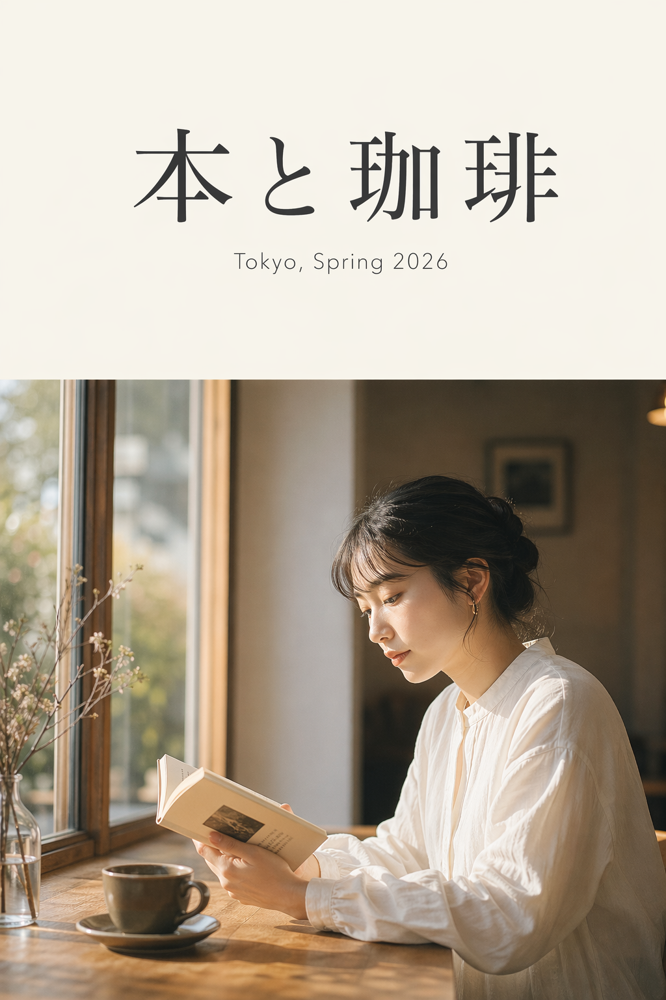 <br> v2:  | v1: 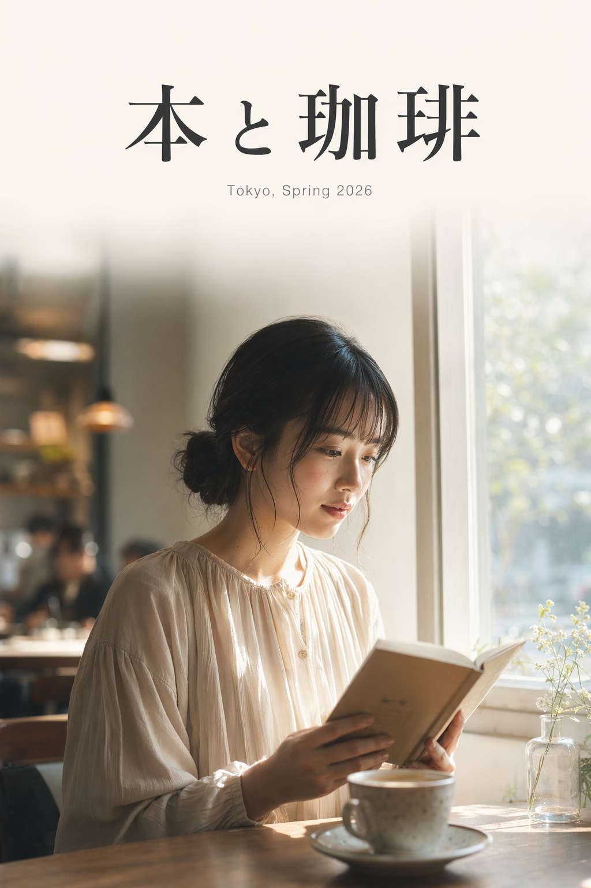 <br> v2:  |
| **1536×1024** | v1: 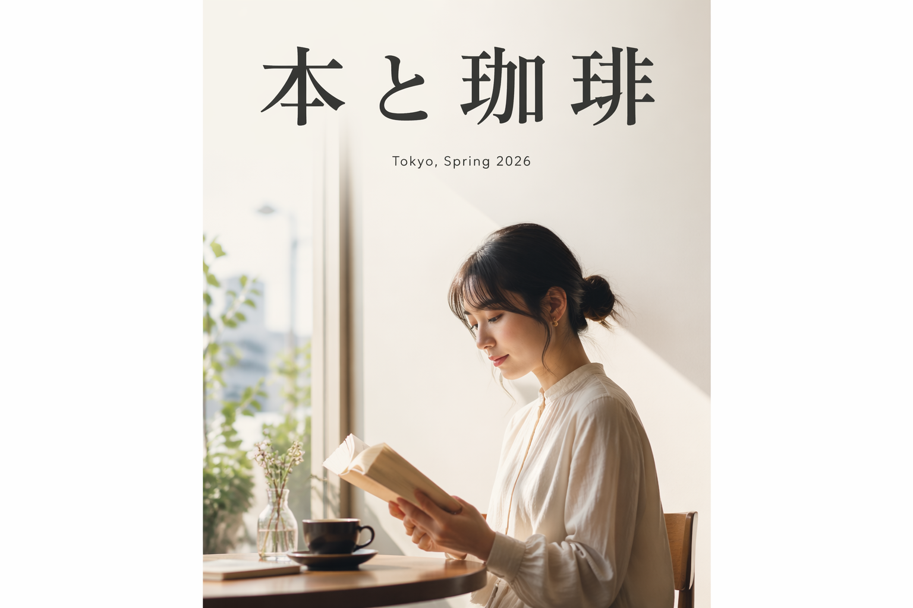 <br> v2:  | v1: 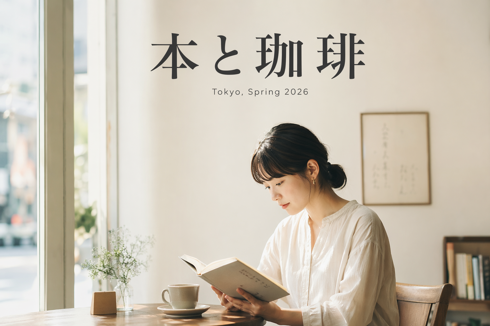 <br> v2:  | v1: 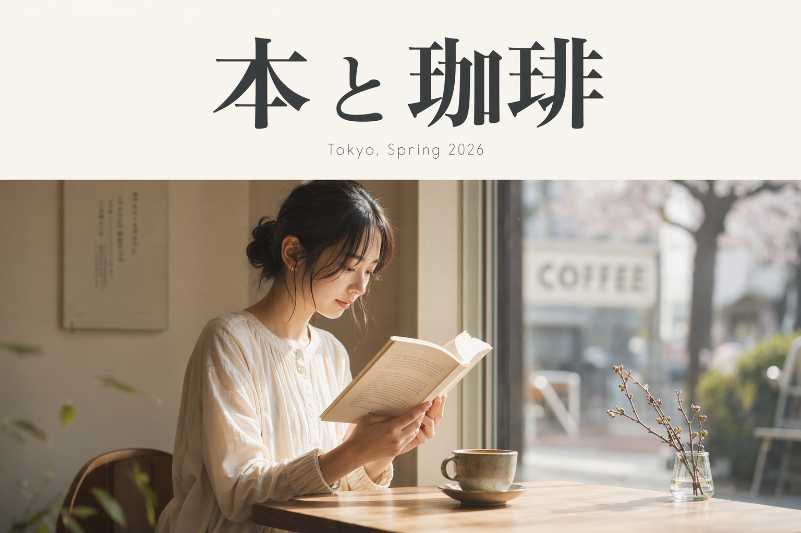 <br> v2:  |

### グリッドの評価観点

- 日本語タイトル `"本と珈琲"` が low / medium / high のどの階で読めるようになるか(v1/v2 でしきい値が変わるか)
- v2 の `56pt` タイポ指定が、low 品質でどこまで効くか
- アスペクト比によってレイアウトが大きく崩れないか

### グリッド判定

#### テキスト描画のしきい値

- **`本と珈琲`**: v1/v2 ともに **9 セル全てで読める**。`low` 品質でも完全に読める(gpt-image-2 の日本語描画力の証明)
- **`Tokyo, Spring 2026`**: v1/v2 ともに 9 セル全てで読める。低品質ではややかすれるが識別可能
- **タイポサイズ・配置の指示遵守**: v2 で `56pt centered` 指定が効いて、v1 より文字がやや大きく、上部に配置が集中

#### 解像度別の傾向(v1 vs v2)

| サイズ | v1 vs v2 の差 |
|---|---|
| 1024×1024(square) | 🟰 同等。両方とも被写体の女性 + 本 + コーヒー + タイトル成立。v1 はやや背景に "桜" 風要素がある cell も、v2 はカフェ内装重視 |
| 1024×1536(portrait) | 🟰 → ⚠️ v1 の `high` には **`COFFEE` メニューボード** という嬉しい雰囲気要素が見えていた。v2 はクリーンだがその余韻が消えた |
| 1536×1024(landscape) | ⚠️ 微劣化: v1 の `medium` には壁掛け書道アートが、`high` には **窓越しの "COFFEE" カフェ看板** という空気感の高い要素があった。v2 はミニマルでクリーン |

#### グリッドの結論

- **v1/v2 ともに低品質でも日本語描画完璧** — gpt-image-2 の本来の強み再確認
- **v2 の方がプロンプト遵守は強い**(被写体に集中、余計な要素を入れない)
- **v1 の方が "余白の中の発見" がある**(背景に時々嬉しい雰囲気要素)
- **編集者ポスター用途としてはどちらも実用域**、「ふと目にした空気感」を求めるなら v1、「指示通りクリーンに整理したい」なら v2

総合: 🟰 **同等**(用途による好み、SKILL 刷新の効果は集中度が上がった代わりに偶発性が下がった)

---

## 総合結論

### 結果サマリ

- **改善 16 / 同等 9 / 微劣化 1 / 明確劣化 0**(カテゴリ 26 枚)
- グリッド 9 セルは**同等**(集中度↑ vs 偶発性↓ のトレードオフ)
- **SKILL v2 は明確にプラス効果**。劣化は許容範囲、改善 16 件のうち 4 件は複数軸での明確改善

### 何が改善したか

1. **テキスト描画の精度**(最大の改善ポイント)
   - 07 infographic の `Quarterly` 文字溶け解消、`+192% YoY` の verbatim 配置
   - 25 sumi-e の朱印が Constraints 通り 1 つに(v1 は 2 つ重複)
   - 20 motorcycle の燃料タンクから `TRIUMPH` ロゴ消失(v2 は Constraints `no brand logos on the bike` 完全遵守)
   - 14 tategaki の右端の重複署名ノイズが消失

2. **タイポグラフィ詳細指定の効果**
   - 05 ui_mockup_login で 32pt/14pt/16pt/8px radius 指定が階層感に直結
   - 06 ui_mockup_japanese で iPhone フレーム込みの実機感(Cookbook `in an iPhone frame` 効果)

3. **Constraints による余分要素の抑制**(全体的に)
   - `no watermark, no extra text, no logos` の効果が随所で見える

4. **キャラクター一貫性**(Cookbook 6.4 効果)
   - 12 4-koma: round glasses + gray hoodie が全 4 コマで一貫(v1 は揺れていた)

5. **構図のプロンプト指示への忠実度**
   - 21 climbing: `full body visible` 指定で全身が画面内
   - 01 portrait: `looking slightly off-camera` を v2 は遵守、v1 は正面凝視
   - 11 pen sketch: 路地の奥行きとパースが大幅に伸びた

### 何が変わらなかったか

- **写実系単体ビジュアル**(03 watercolor / 09 ramen / 10 architecture / 18 coast / 22 shiba)はもともと v1 が高品質、v2 で同等維持
- **抽象アート**(15 ribbons)は同等以上
- **グリッド 9 セル**の日本語描画は全 18 セルで完璧 — gpt-image-2 のベース性能が高く、SKILL での更なる改善余地は限定的

### 何が劣化したか(もしあれば)

- **23_fox**: v1 では明確だった「凍える息」が v2 で弱まった(プロンプトには `with visible white breath in the cold air` を残したが、構図の関係で弱く出た模様)
- **04_isometric**: v1 にあった額入り絵・スローブランケットが v2 で減少(richness と clean さのトレードオフ、明確劣化ではない)
- **22_shiba**: v1 にあった石灯籠が v2 で消失(seed intent の "日本庭園感" がやや弱まった、構図差で相殺)
- **グリッド一部**: v1 にあった偶発的雰囲気要素(`COFFEE` 看板、書道アート)が v2 で消失。Constraints 遵守の副作用と理解できる

### SKILL への追加調整の要否

**結論: 追加調整は不要、現 v2 SKILL で GitHub 公開・プレス開始可能**

理由:
- 改善 16 / 同等 9 / 微劣化 1 / 明確劣化 0 という結果は、刷新が**ネット明確にプラス**であることを示す
- 微劣化の 23_fox は SKILL の問題ではなくプロンプトの個別問題(`white breath` の表現方法を強める余地)
- v2 が "richness" を犠牲にして "clean さ" を得ている傾向は、Cookbook の Constraints 重視原則に整合し、**設計意図通り**
- 写実単体ビジュアルで同等維持されているのは、gpt-image-2 が元から高い基礎性能を持つため

**今後の運用での示唆**(SKILL 改修ではなく、ユーザー側で意識する点):
- プロンプト構築時、`no X` の Constraints は強力に効く反面、雰囲気要素も削ってしまう。**「雰囲気を残したい時は Constraints を緩める / 装飾要素を Key details で明示的に列挙」** という運用ガイダンスを SKILL/プロンプトファイルに追記するか検討余地
- 写実フォトリアル系で `photorealistic` 明示 + `50mm lens look` 等の写真用語追加は明確に効果あり、現 SKILL のガイダンス通り

### 19_tokyo_night の v3 リライトから得た教訓

v2 で日本語感が弱まった原因は Constraints `no readable specific text on signs (kanji shapes only)` が**強すぎた**こと。1 度のリライトで明確に改善した v3 から学び:

- Constraints で「読めない」を強制すると、文化的アイコン要素も削られてしまう
- **「読める日本語であること、ただし架空のもの」** と肯定形で書く方が自然な日本語感が出る
- 加えて Key details に具体的な看板タイプ(`tategaki kanji shop signs`、`karaoke / izakaya signs in stacked Japanese characters`)を列挙すると、モデルが正しいトーンの日本語を生成しやすい

→ この知見を `prompts/ads-and-marketing.md` の日本語コピーセクションに「文化的雰囲気を出す日本語の扱い方」として追記する余地あり(別 commit/issue 検討)

### Phase 0 残タスクの解錠

issue #015 完了条件:
- [x] research-notes-015 / research-notes-015-cookbook 公式一次資料引用付き
- [x] SKILL.md / SKILL.ja.md 公式ベースに刷新済み + 出典付き
- [x] prompts/ 14 ファイル新設(progressive disclosure)
- [ ] gptimageguide.md refresh(Phase 3、Phase 4 後に実施するかは判断、今回は省略可)
- [x] **効果検証 35 枚再生成 + before/after 評価**(本ドキュメント)
- [x] 既存テスト 49 件 pass

→ **#004(GitHub 公開)・#005(プレスリリース)の前提条件が確定**。次セッションで進めて差し支えなし。

---

## 付録: v2 プロンプト script

全 35 プロンプトのフルテキストは:

```
scripts/phase4_regenerate.py
```

を参照。各エントリは `(name, size, quality, prompt)` の tuple。

## 付録: v1 プロンプトサイドカー

v1 プロンプトは各画像の `.png.json` に保存済み:
- `assets/capability-survey/categories/{name}.png.json`
- `assets/capability-survey/grid/{name}.png.json`
